# Vibe Metrics — NSW Report
Generated 16 March 2026. Data: ABS Census 2021 (Census + Working Population Profile). 1,202 SA2s nationally, 354 in NSW.

## Lifestyle & Liveability
Resident-based Census metrics on how people live, move, and feel in each area.

### Car Jail Score
% of dwellings with zero cars. Higher = car-free lifestyle is realistic.
> **Calc:** G34 → `Num_MVs_per_dweling_0_MVs` ÷ `Total_dwelings`
✅ **High:** You can live here without a car — no rego, no parking bills, no Sunday afternoon panic when something rattles. Transit and your legs are genuinely enough.
❌ **Low:** A car is non-negotiable. Factor insurance, rego and petrol on top of rent before you sign anything.
NSW avg: **10.0** | AUS avg: **7.9** | NSW range: 0.0–67.3
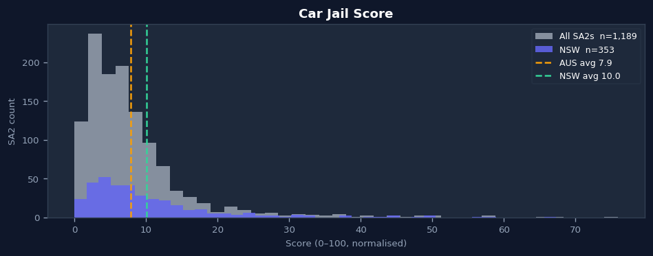

**Top 10 NSW**
| # | SA2 | LGA | Score |
|---|---|---|---|
| 1 | Melbourne CBD - West | Melbourne | 67.3 |
| 2 | Chippendale | Sydney | 58.6 |
| 3 | Sydney (South) - Haymarket | Sydney | 57.1 |
| 4 | Sydney (North) - Millers Point | Sydney | 50.4 |
| 5 | Potts Point - Woolloomooloo | Sydney | 49.1 |
| 6 | Surry Hills | Sydney | 47.4 |
| 7 | Darlinghurst | Sydney | 45.1 |
| 8 | Ultimo | Sydney | 44.9 |
| 9 | Barkly | Barkly | 43.4 |
| 10 | Southbank - East | Melbourne | 41.6 |

**Bottom 10 NSW**
| # | SA2 | LGA | Score |
|---|---|---|---|
| 1 | Smithfield Industrial | Cumberland | 0.0 |
| 2 | Sydney Airport | Bayside (NSW) | 0.0 |
| 3 | Port Botany Industrial | Randwick | 0.0 |
| 4 | Prospect Reservoir | Blacktown | 0.0 |
| 5 | Jilliby - Yarramalong | Central Coast (NSW) | 0.0 |
| 6 | Tomerong - Wandandian - Woollamia | Shoalhaven | 0.2 |
| 7 | Queanbeyan Surrounds | Queanbeyan-Palerang | 0.7 |
| 8 | Seaham - Woodville | Port Stephens | 0.8 |
| 9 | Bangalow | Byron | 0.9 |
| 10 | Kurrajong Heights - Ebenezer | Hawkesbury | 0.9 |

---

### Car-Free Commute
% of workers who don't use a private car to get to work.
> **Calc:** G62 → (`Tot_P` − `Car_as_driver_P` − `Car_as_passenger_P` − `Truck_P`) ÷ `Tot_P`
✅ **High:** Real public transport or walkable commutes. You're not stuck depending on a car you can barely afford to run.
❌ **Low:** Everyone drives. If you don't own one, getting to work or placement is genuinely painful.
NSW avg: **53.7** | AUS avg: **43.6** | NSW range: 0.0–100.0
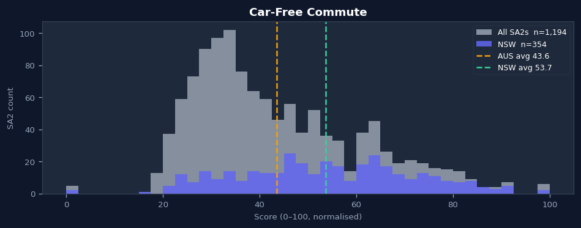

**Top 10 NSW**
| # | SA2 | LGA | Score |
|---|---|---|---|
| 1 | Port Kembla Industrial | Wollongong | 100.0 |
| 2 | Smithfield Industrial | Cumberland | 100.0 |
| 3 | Melbourne CBD - West | Melbourne | 91.4 |
| 4 | Sydney (South) - Haymarket | Sydney | 91.3 |
| 5 | Sydney (North) - Millers Point | Sydney | 90.8 |
| 6 | Chippendale | Sydney | 90.3 |
| 7 | Surry Hills | Sydney | 90.2 |
| 8 | Ultimo | Sydney | 89.2 |
| 9 | Potts Point - Woolloomooloo | Sydney | 89.1 |
| 10 | Darlinghurst | Sydney | 89.0 |

**Bottom 10 NSW**
| # | SA2 | LGA | Score |
|---|---|---|---|
| 1 | Port Botany Industrial | Randwick | 0.0 |
| 2 | Prospect Reservoir | Blacktown | 0.0 |
| 3 | Griffith (NSW) | Griffith | 15.7 |
| 4 | Leeton | Leeton | 20.1 |
| 5 | Lavington | Albury | 20.8 |
| 6 | Dubbo - West | Dubbo | 20.8 |
| 7 | Dubbo - East | Dubbo | 21.1 |
| 8 | Wagga Wagga - East | Wagga Wagga | 21.6 |
| 9 | Kempsey | Kempsey | 22.6 |
| 10 | Wagga Wagga - North | Wagga Wagga | 22.6 |

---

### WFH Culture Index
% of workers who worked from home. High = daytime café culture, flexibility.
> **Calc:** G62 → `Worked_home_P` ÷ `Tot_P`
✅ **High:** Cafés have daytime crowds, co-working culture is normal, and flexible work is part of the local fabric — likely to carry into your first job here.
❌ **Low:** The suburb empties out 8–5. If you're studying from home, you'll feel it.
NSW avg: **30.3** | AUS avg: **20.5** | NSW range: 0.0–61.9
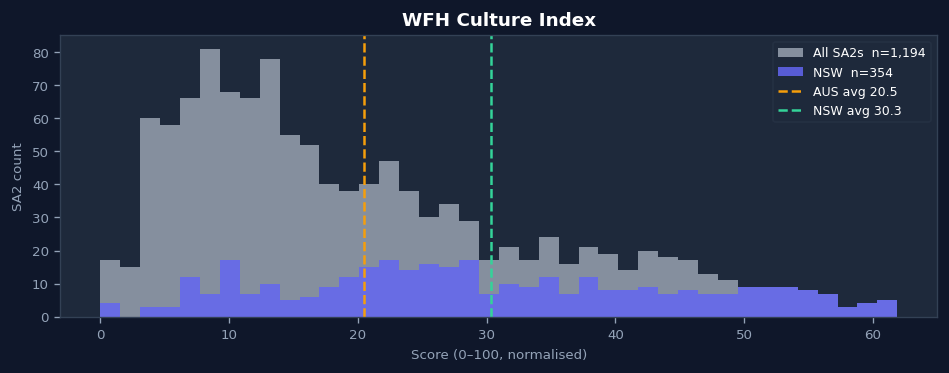

**Top 10 NSW**
| # | SA2 | LGA | Score |
|---|---|---|---|
| 1 | North Sydney - Lavender Bay | North Sydney | 61.9 |
| 2 | Crows Nest - Waverton | North Sydney | 61.6 |
| 3 | St Leonards - Naremburn | North Sydney | 61.5 |
| 4 | Erskineville - Alexandria | Sydney | 61.3 |
| 5 | Balmain | Inner West | 61.2 |
| 6 | Mosman - South | Mosman | 59.4 |
| 7 | Paddington - Moore Park | Sydney | 59.0 |
| 8 | Double Bay - Darling Point | Woollahra | 59.0 |
| 9 | Lilyfield - Rozelle | Inner West | 58.9 |
| 10 | Manly - Fairlight | Northern Beaches | 58.3 |

**Bottom 10 NSW**
| # | SA2 | LGA | Score |
|---|---|---|---|
| 1 | Port Kembla Industrial | Wollongong | 0.0 |
| 2 | Smithfield Industrial | Cumberland | 0.0 |
| 3 | Port Botany Industrial | Randwick | 0.0 |
| 4 | Prospect Reservoir | Blacktown | 0.0 |
| 5 | Griffith (NSW) | Griffith | 3.7 |
| 6 | East Side | Alice Springs | 4.0 |
| 7 | Broken Hill | Broken Hill | 4.2 |
| 8 | Tamworth - West | Tamworth | 5.7 |
| 9 | Kempsey | Kempsey | 5.8 |
| 10 | Lavington | Albury | 5.9 |

---

### Pedal & Path Score
% cycling or walking to work. High = flat, safe, bikeable streets.
> **Calc:** G62 → (`One_method_Bicycle_P` + `One_method_Walked_only_P`) ÷ `Tot_P`
✅ **High:** Flat, connected, safe enough to bike or walk daily. Skip the gym membership, save on transport, arrive in a better mood.
❌ **Low:** Not built for bikes or feet. You need wheels — or a very long playlist for the commute.
NSW avg: **3.7** | AUS avg: **3.9** | NSW range: 0.0–50.0
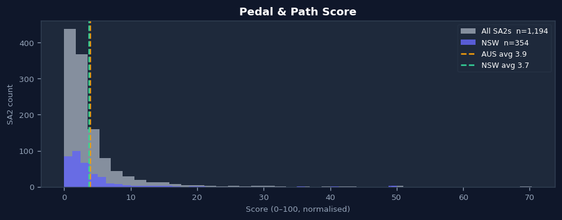

**Top 10 NSW**
| # | SA2 | LGA | Score |
|---|---|---|---|
| 1 | Smithfield Industrial | Cumberland | 50.0 |
| 2 | Sydney Airport | Bayside (NSW) | 50.0 |
| 3 | Barkly | Barkly | 40.9 |
| 4 | Hobart | Hobart | 35.8 |
| 5 | Wetherill Park Industrial | Fairfield | 20.0 |
| 6 | Sydney (South) - Haymarket | Sydney | 19.3 |
| 7 | Ultimo | Sydney | 16.3 |
| 8 | Sydney (North) - Millers Point | Sydney | 16.0 |
| 9 | Melbourne CBD - West | Melbourne | 15.4 |
| 10 | Darlinghurst | Sydney | 14.6 |

**Bottom 10 NSW**
| # | SA2 | LGA | Score |
|---|---|---|---|
| 1 | Port Kembla Industrial | Wollongong | 0.0 |
| 2 | Port Botany Industrial | Randwick | 0.0 |
| 3 | Prospect Reservoir | Blacktown | 0.0 |
| 4 | Hinchinbrook | Liverpool | 0.2 |
| 5 | Schofields - East | Blacktown | 0.3 |
| 6 | Prestons | Liverpool | 0.5 |
| 7 | Doonside - Woodcroft | Blacktown | 0.5 |
| 8 | Claymore - Eagle Vale - Raby | Campbelltown (NSW) | 0.5 |
| 9 | North Kellyville | The Hills | 0.5 |
| 10 | Glenmore Park - Regentville | Penrith | 0.6 |

---

### Night Shift Neighbours
% of residents employed in hospitality + arts/rec. These are the people who live here — not a measure of local venues.
> **Calc:** G54A+B → (`Accom_food_Tot` + `Art_recn_Tot`) M+F ÷ sum of all industry `_Tot` M+F
✅ **High:** Your neighbours work in hospitality and creative industries — sign of a young, social, culturally active resident community.
❌ **Low:** The local workforce is dominated by 9-to-5ers. The energy of who lives here skews corporate or suburban.
NSW avg: **8.2** | AUS avg: **8.8** | NSW range: 0.0–27.2
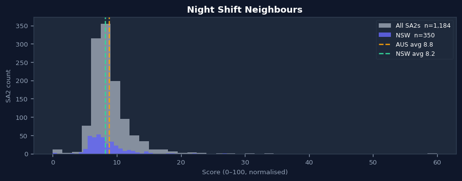

**Top 10 NSW**
| # | SA2 | LGA | Score |
|---|---|---|---|
| 1 | Sydney (South) - Haymarket | Sydney | 27.2 |
| 2 | Melbourne CBD - West | Melbourne | 22.2 |
| 3 | Hobart | Hobart | 18.4 |
| 4 | Ultimo | Sydney | 17.9 |
| 5 | Nelson Bay Peninsula | Port Stephens | 15.6 |
| 6 | Southbank - East | Melbourne | 15.1 |
| 7 | Tweed Heads South | Tweed | 14.9 |
| 8 | Katoomba - Leura | Blue Mountains | 14.7 |
| 9 | Nambucca Heads | Nambucca Valley | 14.7 |
| 10 | Moama | Murray River | 14.5 |

**Bottom 10 NSW**
| # | SA2 | LGA | Score |
|---|---|---|---|
| 1 | Smithfield Industrial | Cumberland | 0.0 |
| 2 | Wetherill Park Industrial | Fairfield | 0.0 |
| 3 | Armidale Surrounds - North | Armidale | 2.9 |
| 4 | Horsley Park - Kemps Creek | Fairfield | 4.3 |
| 5 | West Pennant Hills | The Hills | 4.3 |
| 6 | Chullora | Canterbury-Bankstown | 4.5 |
| 7 | Inverell Surrounds - West | Gwydir | 4.7 |
| 8 | Schofields - East | Blacktown | 5.1 |
| 9 | Castle Hill - West | The Hills | 5.1 |
| 10 | Baulkham Hills (West) - Bella Vista | The Hills | 5.3 |

---

### Professional Neighbours
% of residents employed in professional, education, and health jobs. Reflects who lives here, not what's nearby.
> **Calc:** G54A+B → (`Pro_scien_tec_Tot` + `Educ_trng_Tot` + `HlthCare_SocAs_Tot`) M+F ÷ sum of all industry `_Tot` M+F
✅ **High:** Educated, career-focused residents — good for informal networking and a neighbourhood that invests in itself. Can push rents up though.
❌ **Low:** Fewer professionals in the mix. May mean less networking pressure — or fewer people to connect with in your field.
NSW avg: **33.5** | AUS avg: **32.6** | NSW range: 0.0–46.3
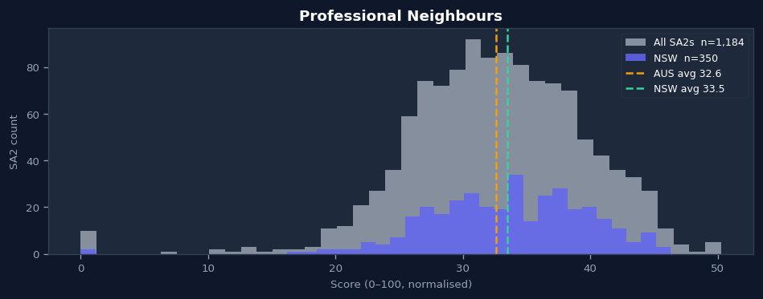

**Top 10 NSW**
| # | SA2 | LGA | Score |
|---|---|---|---|
| 1 | Camperdown - Darlington | Sydney | 46.3 |
| 2 | Wahroonga (East) - Warrawee | Ku-ring-gai | 45.5 |
| 3 | Greenwich - Riverview | Lane Cove | 45.2 |
| 4 | Newcastle - Cooks Hill | Newcastle | 45.0 |
| 5 | Glebe - Forest Lodge | Sydney | 45.0 |
| 6 | Armidale | Armidale | 44.5 |
| 7 | Turramurra | Ku-ring-gai | 44.3 |
| 8 | Normanhurst - Thornleigh - Westleigh | Hornsby | 44.2 |
| 9 | Parramatta - North | Parramatta | 44.1 |
| 10 | Ballarat | Ballarat | 44.0 |

**Bottom 10 NSW**
| # | SA2 | LGA | Score |
|---|---|---|---|
| 1 | Smithfield Industrial | Cumberland | 0.0 |
| 2 | Wetherill Park Industrial | Fairfield | 0.0 |
| 3 | Barkly | Barkly | 16.4 |
| 4 | Singleton | Singleton | 18.3 |
| 5 | Muswellbrook | Muswellbrook | 19.3 |
| 6 | Yarramundi - Londonderry | Penrith | 19.6 |
| 7 | Cabramatta - Lansvale | Fairfield | 20.6 |
| 8 | Corowa Surrounds | Federation | 20.6 |
| 9 | Mudgee Surrounds - West | Mid-Western | 21.7 |
| 10 | Canley Vale - Canley Heights | Fairfield | 21.9 |

---

### Student Bubble Density
% of population attending uni or TAFE aged 15–24.
> **Calc:** G15 → (`Tert_Uni_*_15_24_P` + `Tert_Voc_*_15_24_P`) ÷ `Tot_P`
✅ **High:** Genuine student area — cheap food options, campus events, people in the same life stage. You won't feel out of place studying at midnight.
❌ **Low:** Students are a small minority here. The suburb doesn't run on the academic calendar and won't particularly cater to you.
NSW avg: **12.5** | AUS avg: **12.0** | NSW range: 0.0–51.2
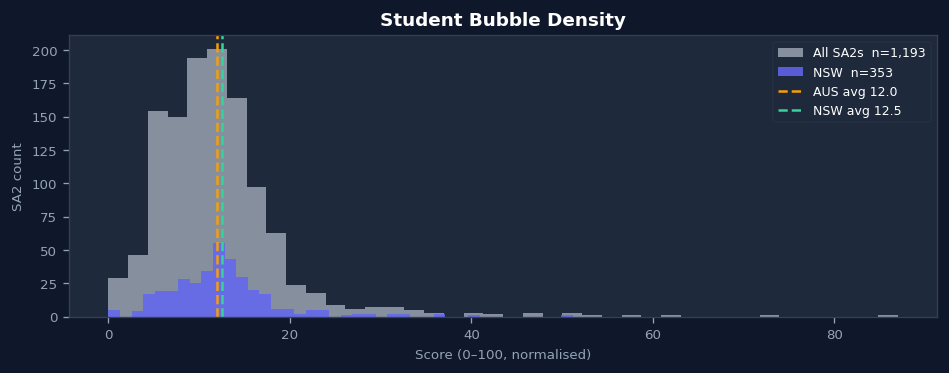

**Top 10 NSW**
| # | SA2 | LGA | Score |
|---|---|---|---|
| 1 | Camperdown - Darlington | Sydney | 51.2 |
| 2 | Chippendale | Sydney | 40.6 |
| 3 | Shortland - Jesmond | Newcastle | 36.3 |
| 4 | Kensington (NSW) | Randwick | 36.1 |
| 5 | Melbourne CBD - West | Melbourne | 32.4 |
| 6 | Strathfield - East | Burwood | 32.0 |
| 7 | Zetland | Sydney | 31.6 |
| 8 | Wagga Wagga - North | Wagga Wagga | 31.3 |
| 9 | Ultimo | Sydney | 29.3 |
| 10 | Burwood (NSW) | Burwood | 28.6 |

**Bottom 10 NSW**
| # | SA2 | LGA | Score |
|---|---|---|---|
| 1 | Smithfield Industrial | Cumberland | 0.0 |
| 2 | Wetherill Park Industrial | Fairfield | 0.0 |
| 3 | Sydney Airport | Bayside (NSW) | 0.0 |
| 4 | Port Botany Industrial | Randwick | 0.0 |
| 5 | Prospect Reservoir | Blacktown | 0.0 |
| 6 | Dorrigo | Bellingen | 2.9 |
| 7 | Mullumbimby | Byron | 3.0 |
| 8 | East Side | Alice Springs | 3.7 |
| 9 | Tamworth - West | Tamworth | 3.7 |
| 10 | Grafton Surrounds | Clarence Valley | 3.9 |

---

### Renter Republic Score
% of dwellings being rented. High = share-house culture, short leases.
> **Calc:** G37 → sum of `R_*_Total` cols ÷ `Total_Total`
✅ **High:** Renting is the norm. Landlords are used to students and young tenants, listings are plentiful, and share-house culture is embedded.
❌ **Low:** Owner-occupier territory. Rental stock is thin, landlords may prefer long-term stable tenants, and the culture assumes you're buying eventually.
NSW avg: **33.9** | AUS avg: **32.9** | NSW range: 0.0–76.2
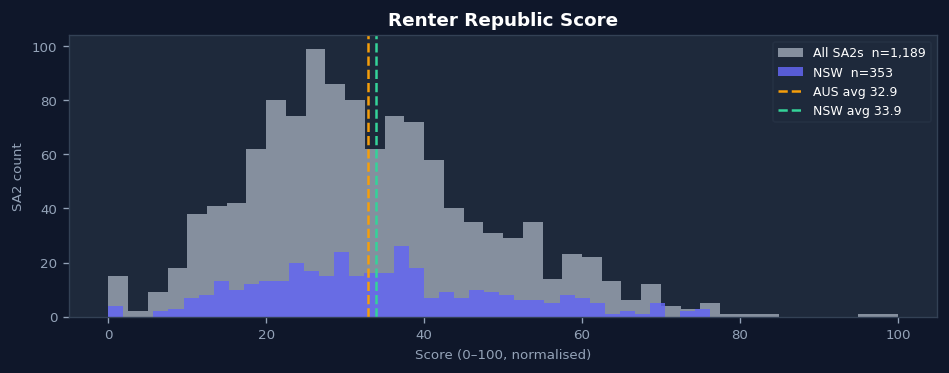

**Top 10 NSW**
| # | SA2 | LGA | Score |
|---|---|---|---|
| 1 | Melbourne CBD - West | Melbourne | 76.2 |
| 2 | Chippendale | Sydney | 76.0 |
| 3 | Parramatta - North | Parramatta | 74.8 |
| 4 | Sydney (South) - Haymarket | Sydney | 73.8 |
| 5 | Waterloo | Sydney | 72.8 |
| 6 | Zetland | Sydney | 70.4 |
| 7 | Rosehill - Harris Park | Parramatta | 69.6 |
| 8 | Liverpool - East | Liverpool | 69.6 |
| 9 | Parramatta - South | Parramatta | 68.8 |
| 10 | Southbank - East | Melbourne | 68.7 |

**Bottom 10 NSW**
| # | SA2 | LGA | Score |
|---|---|---|---|
| 1 | Smithfield Industrial | Cumberland | 0.0 |
| 2 | Sydney Airport | Bayside (NSW) | 0.0 |
| 3 | Port Botany Industrial | Randwick | 0.0 |
| 4 | Prospect Reservoir | Blacktown | 0.0 |
| 5 | Seaham - Woodville | Port Stephens | 6.7 |
| 6 | Lilli Pilli - Port Hacking - Dolans Bay | Sutherland | 6.8 |
| 7 | Jilliby - Yarramalong | Central Coast (NSW) | 8.4 |
| 8 | Bathurst Surrounds | Bathurst | 8.6 |
| 9 | Tomerong - Wandandian - Woollamia | Shoalhaven | 9.3 |
| 10 | Queanbeyan Surrounds | Queanbeyan-Palerang | 9.6 |

---

### Vertical City Score
% of dwellings that are flats or apartments. High = dense urban living.
> **Calc:** G36 → sum of `Flt_apart_*_Dwgs` cols ÷ `OPDs_Tot_OPDs_Dwellings`
✅ **High:** Dense apartment living — more stock to choose from, often closer to transit and amenities, lower per-person cost in a share.
❌ **Low:** House-dominated suburb. Rent per person in a share house may be higher, and everything is more spread out.
NSW avg: **23.7** | AUS avg: **16.7** | NSW range: 0.0–99.2
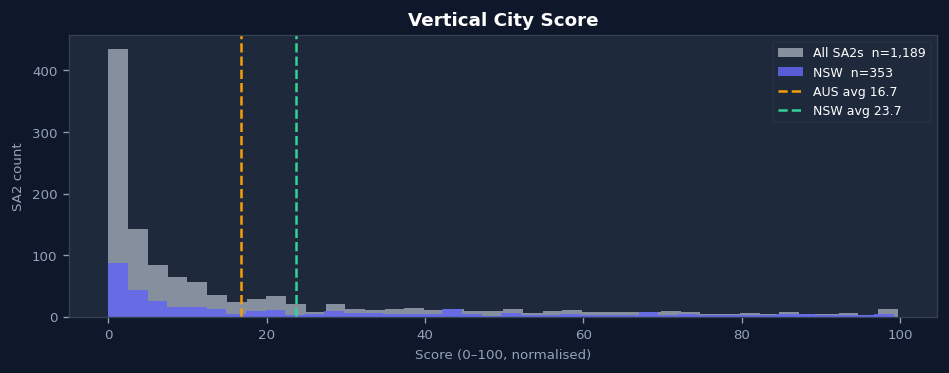

**Top 10 NSW**
| # | SA2 | LGA | Score |
|---|---|---|---|
| 1 | Melbourne CBD - West | Melbourne | 99.2 |
| 2 | Sydney (South) - Haymarket | Sydney | 99.1 |
| 3 | Wentworth Point - Sydney Olympic Park | Parramatta | 98.1 |
| 4 | Southbank - East | Melbourne | 97.7 |
| 5 | Parramatta - North | Parramatta | 95.8 |
| 6 | Rhodes | Canada Bay | 95.1 |
| 7 | Pyrmont | Sydney | 93.7 |
| 8 | Sydney (North) - Millers Point | Sydney | 92.8 |
| 9 | Zetland | Sydney | 92.5 |
| 10 | Liverpool - East | Liverpool | 91.2 |

**Bottom 10 NSW**
| # | SA2 | LGA | Score |
|---|---|---|---|
| 1 | Smithfield Industrial | Cumberland | 0.0 |
| 2 | Wetherill Park Industrial | Fairfield | 0.0 |
| 3 | Sydney Airport | Bayside (NSW) | 0.0 |
| 4 | Port Botany Industrial | Randwick | 0.0 |
| 5 | Prospect Reservoir | Blacktown | 0.0 |
| 6 | Barkly | Barkly | 0.0 |
| 7 | Murwillumbah Surrounds | Tweed | 0.0 |
| 8 | Lilli Pilli - Port Hacking - Dolans Bay | Sutherland | 0.0 |
| 9 | Harrington Park | Camden | 0.0 |
| 10 | Bathurst Surrounds | Bathurst | 0.1 |

---

### Housing Stress Ratio
Annual rent as % of personal income. Above 30% = financially tight. ⚠️ High is bad.
> **Calc:** G02 → (`Median_rent_weekly` × 52) ÷ (`Median_tot_prsnl_inc_weekly` × 52) × 100
✅ **Low:** Rent is manageable relative to local incomes. Financial breathing room for going out, saving, or surviving on a part-time wage while studying.
❌ **High:** Rent swallows a disproportionate share of income here. You will feel it every fortnight — especially on a student or entry-level wage.
NSW avg: **51.6** | AUS avg: **46.2** | NSW range: 0.0–98.0
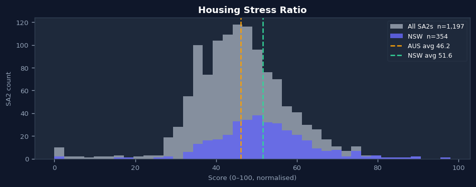

**Top 10 NSW**
| # | SA2 | LGA | Score |
|---|---|---|---|
| 1 | Belrose | Northern Beaches | 98.0 |
| 2 | Greenacre - South | Canterbury-Bankstown | 88.8 |
| 3 | Condell Park | Canterbury-Bankstown | 88.3 |
| 4 | Wetherill Park Industrial | Fairfield | 85.8 |
| 5 | Smithfield - Wetherill Park | Fairfield | 85.5 |
| 6 | Fairfield | Fairfield | 81.0 |
| 7 | Frenchs Forest - Oxford Falls | Northern Beaches | 79.5 |
| 8 | Bankstown - South | Canterbury-Bankstown | 78.9 |
| 9 | Auburn - Central | Cumberland | 78.8 |
| 10 | Chester Hill - Sefton | Canterbury-Bankstown | 77.4 |

**Bottom 10 NSW**
| # | SA2 | LGA | Score |
|---|---|---|---|
| 1 | Port Kembla Industrial | Wollongong | 0.0 |
| 2 | Sydney Airport | Bayside (NSW) | 0.0 |
| 3 | Barkly | Barkly | 16.8 |
| 4 | Smithfield Industrial | Cumberland | 17.6 |
| 5 | Nyngan - Warren | Bogan | 26.7 |
| 6 | Queanbeyan - East | Queanbeyan-Palerang | 28.1 |
| 7 | Albury - South | Albury | 29.2 |
| 8 | Potts Point - Woolloomooloo | Sydney | 31.9 |
| 9 | East Side | Alice Springs | 32.2 |
| 10 | Forbes | Forbes | 32.2 |

---

### Fresh Energy Score
% who moved to this area in the last 12 months. High = dynamic social scene.
> **Calc:** G44 → `Difnt_Usl_add_1_yr_ago_Tot_P` ÷ `Tot_P`
✅ **High:** Lots of newcomers — easy to meet people, social networks are forming rather than closed. You won't be the only one figuring out where the good coffee is.
❌ **Low:** Settled, established community. Social circles are long-standing and harder to break into. Could be stable and warm — or just insular.
NSW avg: **15.9** | AUS avg: **16.4** | NSW range: 0.0–53.5
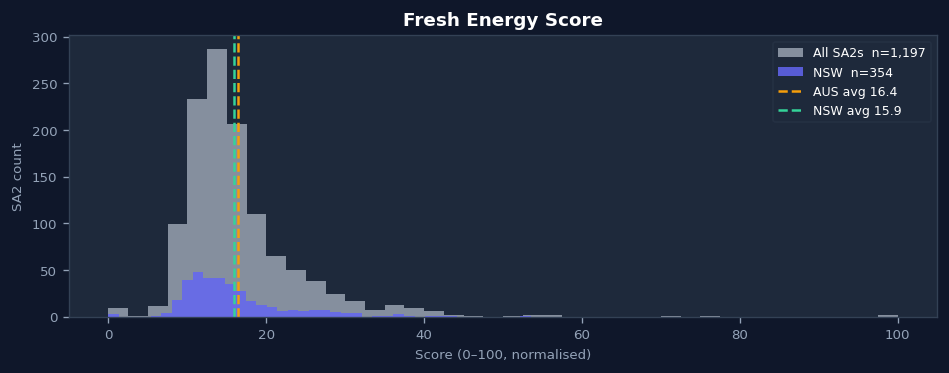

**Top 10 NSW**
| # | SA2 | LGA | Score |
|---|---|---|---|
| 1 | Melbourne CBD - West | Melbourne | 53.5 |
| 2 | Southbank - East | Melbourne | 43.9 |
| 3 | Chippendale | Sydney | 42.1 |
| 4 | Zetland | Sydney | 41.0 |
| 5 | Ultimo | Sydney | 38.3 |
| 6 | Sydney (South) - Haymarket | Sydney | 37.2 |
| 7 | Wentworth Point - Sydney Olympic Park | Parramatta | 36.4 |
| 8 | Rhodes | Canada Bay | 36.2 |
| 9 | Camperdown - Darlington | Sydney | 35.2 |
| 10 | Parramatta - North | Parramatta | 34.6 |

**Bottom 10 NSW**
| # | SA2 | LGA | Score |
|---|---|---|---|
| 1 | Port Kembla Industrial | Wollongong | 0.0 |
| 2 | Smithfield Industrial | Cumberland | 0.0 |
| 3 | Port Botany Industrial | Randwick | 0.0 |
| 4 | Horsley Park - Kemps Creek | Fairfield | 5.8 |
| 5 | Hinchinbrook | Liverpool | 7.0 |
| 6 | Yarramundi - Londonderry | Penrith | 7.6 |
| 7 | Prestons | Liverpool | 7.8 |
| 8 | Seaham - Woodville | Port Stephens | 7.8 |
| 9 | Menai - Lucas Heights - Woronora | Sutherland | 8.7 |
| 10 | Engadine | Sutherland | 8.7 |

---

### Community Glue Score
% of 15+ year olds doing voluntary work. High = strong local fabric.
> **Calc:** G23 → `P_Tot_Volunteer` ÷ `P_Tot_Tot`
✅ **High:** People here look out for each other. Strong clubs, events, and local networks. Easy to get involved and meet non-uni people.
❌ **Low:** More anonymous, transient living. Less community infrastructure — can feel isolating if you don't have an existing social base.
NSW avg: **12.9** | AUS avg: **14.1** | NSW range: 0.0–29.4
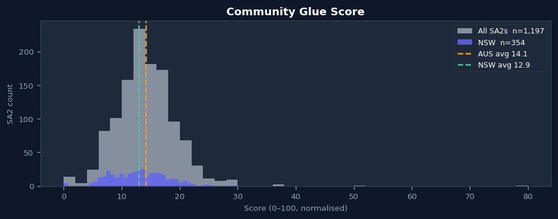

**Top 10 NSW**
| # | SA2 | LGA | Score |
|---|---|---|---|
| 1 | Wetherill Park Industrial | Fairfield | 29.4 |
| 2 | Prospect Reservoir | Blacktown | 25.0 |
| 3 | Braidwood | Queanbeyan-Palerang | 24.7 |
| 4 | Dorrigo | Bellingen | 24.3 |
| 5 | Hobart | Hobart | 23.6 |
| 6 | Greenwich - Riverview | Lane Cove | 22.5 |
| 7 | Inverell Surrounds - West | Gwydir | 22.4 |
| 8 | Bega - Tathra | Bega Valley | 22.4 |
| 9 | Mosman - South | Mosman | 21.5 |
| 10 | Pymble | Ku-ring-gai | 21.4 |

**Bottom 10 NSW**
| # | SA2 | LGA | Score |
|---|---|---|---|
| 1 | Port Kembla Industrial | Wollongong | 0.0 |
| 2 | Smithfield Industrial | Cumberland | 0.0 |
| 3 | Sydney Airport | Bayside (NSW) | 0.0 |
| 4 | Port Botany Industrial | Randwick | 0.0 |
| 5 | Cabramatta - Lansvale | Fairfield | 4.7 |
| 6 | Fairfield | Fairfield | 4.7 |
| 7 | Canley Vale - Canley Heights | Fairfield | 4.9 |
| 8 | Auburn - North | Cumberland | 5.0 |
| 9 | Lurnea - Cartwright | Liverpool | 5.4 |
| 10 | Liverpool - East | Liverpool | 5.5 |

---

### Global Mix Score
Avg of overseas-born % and non-English spoken at home %. High = diverse.
> **Calc:** G02 (`overseas_born_pct`) + G13A (sum `MOL_*_Tot` ÷ `MSEO_Tot`) → average of the two
✅ **High:** Multicultural food, events, languages, and perspectives. Diverse friend groups, international students will feel at home, and the food options are usually excellent.
❌ **Low:** Less cultural diversity. More homogeneous — could feel out of place if you're from elsewhere, and the food scene will reflect it.
NSW avg: **47.0** | AUS avg: **38.9** | NSW range: 0.0–100.0
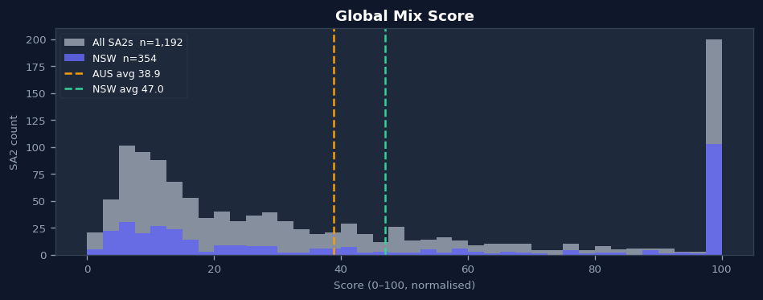

**Top 10 NSW**
| # | SA2 | LGA | Score |
|---|---|---|---|
| 1 | South Hurstville - Blakehurst | Georges River | 100.0 |
| 2 | North Ryde - East Ryde | Ryde | 100.0 |
| 3 | Baulkham Hills (West) - Bella Vista | The Hills | 100.0 |
| 4 | Parramatta - North | Parramatta | 100.0 |
| 5 | Sydney (South) - Haymarket | Sydney | 100.0 |
| 6 | Southbank - East | Melbourne | 100.0 |
| 7 | Granville - Clyde | Cumberland | 100.0 |
| 8 | Ingleburn | Campbelltown (NSW) | 100.0 |
| 9 | Ultimo | Sydney | 100.0 |
| 10 | Schofields - East | Blacktown | 100.0 |

**Bottom 10 NSW**
| # | SA2 | LGA | Score |
|---|---|---|---|
| 1 | Port Kembla Industrial | Wollongong | 0.0 |
| 2 | Port Botany Industrial | Randwick | 0.0 |
| 3 | Prospect Reservoir | Blacktown | 0.0 |
| 4 | Inverell Surrounds - West | Gwydir | 1.2 |
| 5 | Seaham - Woodville | Port Stephens | 2.0 |
| 6 | Tamworth Surrounds | Tamworth | 2.7 |
| 7 | Armidale Surrounds - North | Armidale | 2.8 |
| 8 | Corowa Surrounds | Federation | 2.8 |
| 9 | Mudgee Surrounds - West | Mid-Western | 3.0 |
| 10 | Evans Head | Richmond Valley | 3.1 |

---

## What's Actually Here — Amenities Inferred from Place of Work
These use the Working Population Profile (WPP) — who commutes INTO each SA2 to work. More food workers → real cafés exist. More health workers → real clinics exist. It's an infrastructure signal, not a jobs metric.

### Social Scene Score
Food + Entertainment workers combined. If people work here serving food and running venues — the scene is real, not just on Yelp.
> **Calc:** W09A `AcFd_Tot_P` + W09B `ArtsR_Tot_P` ÷ total POW workers (all industries W09A+B)
✅ **High:** Real venues and food options within walking distance — confirmed by the people actually turning up to staff them.
❌ **Low:** Nothing much happening here at night or on weekends. Every outing requires planning a trip elsewhere.
NSW avg: **8.8** | AUS avg: **9.6** | NSW range: 0.5–29.3
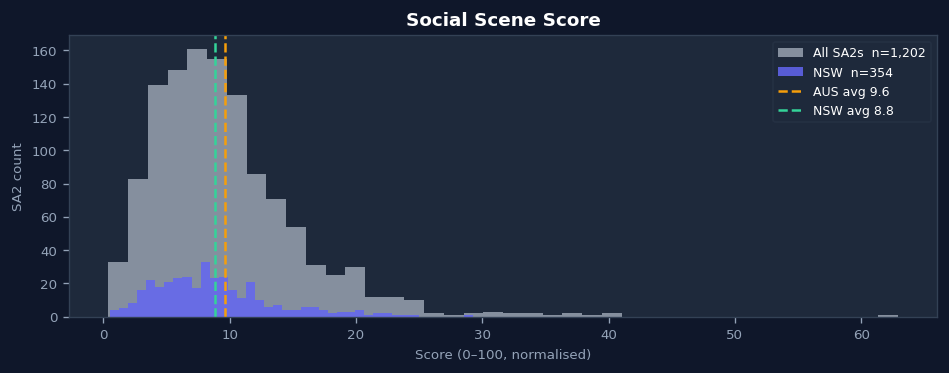

**Top 10 NSW**
| # | SA2 | LGA | Score |
|---|---|---|---|
| 1 | Moama | Murray River | 29.3 |
| 2 | Terrigal - North Avoca | Central Coast (NSW) | 24.8 |
| 3 | Bondi Beach - North Bondi | Waverley | 24.2 |
| 4 | The Entrance | Central Coast (NSW) | 23.2 |
| 5 | Jilliby - Yarramalong | Central Coast (NSW) | 22.6 |
| 6 | Newtown (NSW) | Sydney | 22.3 |
| 7 | Pyrmont | Sydney | 21.8 |
| 8 | Nelson Bay Peninsula | Port Stephens | 21.4 |
| 9 | Kingscliff - Fingal Head | Tweed | 21.0 |
| 10 | Manly - Fairlight | Northern Beaches | 20.4 |

**Bottom 10 NSW**
| # | SA2 | LGA | Score |
|---|---|---|---|
| 1 | Port Botany Industrial | Randwick | 0.5 |
| 2 | Port Kembla Industrial | Wollongong | 0.7 |
| 3 | Smithfield Industrial | Cumberland | 1.1 |
| 4 | Chullora | Canterbury-Bankstown | 1.2 |
| 5 | Horsley Park - Kemps Creek | Fairfield | 1.3 |
| 6 | Blacktown - South | Blacktown | 1.4 |
| 7 | Banksmeadow | Bayside (NSW) | 1.6 |
| 8 | Pallara - Willawong | Brisbane | 1.8 |
| 9 | Prospect Reservoir | Blacktown | 1.9 |
| 10 | Kingsgrove - North | Canterbury-Bankstown | 2.0 |

---

### Food & Drink Scene
Cafes, restaurants, bars physically here. Measured by how many Accommodation & Food workers show up to this SA2 to work.
> **Calc:** W09A → `AcFd_Tot_P` ÷ total POW workers (all industries W09A+B)
✅ **High:** Actual cafés, restaurants and bars exist here — not just on Google Maps, but with real staff turning up daily to prove it.
❌ **Low:** Cooking at home is your primary option. Maybe a servo and a Subway. Plan your meals accordingly.
NSW avg: **7.3** | AUS avg: **7.8** | NSW range: 0.3–23.1
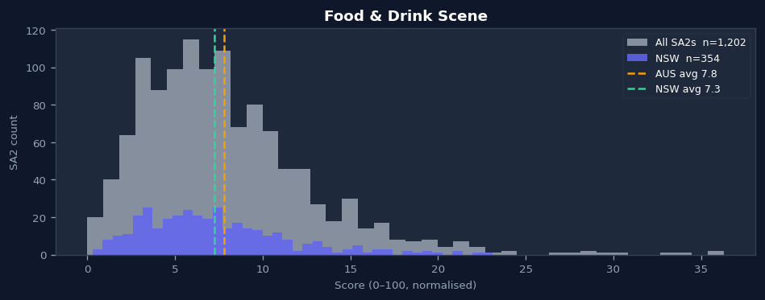

**Top 10 NSW**
| # | SA2 | LGA | Score |
|---|---|---|---|
| 1 | Terrigal - North Avoca | Central Coast (NSW) | 23.1 |
| 2 | The Entrance | Central Coast (NSW) | 22.0 |
| 3 | Moama | Murray River | 21.3 |
| 4 | Bondi Beach - North Bondi | Waverley | 21.0 |
| 5 | Newtown (NSW) | Sydney | 19.7 |
| 6 | Nelson Bay Peninsula | Port Stephens | 19.3 |
| 7 | Kingscliff - Fingal Head | Tweed | 19.2 |
| 8 | Manly - Fairlight | Northern Beaches | 18.8 |
| 9 | Kiama | Kiama | 18.5 |
| 10 | Canley Vale - Canley Heights | Fairfield | 18.4 |

**Bottom 10 NSW**
| # | SA2 | LGA | Score |
|---|---|---|---|
| 1 | Port Kembla Industrial | Wollongong | 0.3 |
| 2 | Port Botany Industrial | Randwick | 0.4 |
| 3 | Currans Hill | Camden | 0.7 |
| 4 | Horsley Park - Kemps Creek | Fairfield | 0.9 |
| 5 | Smithfield Industrial | Cumberland | 0.9 |
| 6 | Chullora | Canterbury-Bankstown | 1.0 |
| 7 | Yarramundi - Londonderry | Penrith | 1.2 |
| 8 | Castle Hill - West | The Hills | 1.2 |
| 9 | Strathfield - West | Strathfield | 1.3 |
| 10 | Blacktown - South | Blacktown | 1.4 |

---

### Entertainment Quarter
Arts & Recreation workers signal venues, theatres, studios and events that actually exist here — not just nearby.
> **Calc:** W09B → `ArtsR_Tot_P` ÷ total POW workers (all industries W09A+B)
✅ **High:** Theatres, live music, gyms, galleries and studios are physically in the area — proven by the workforce showing up to run them.
❌ **Low:** Entertainment infrastructure doesn't exist here. Plan to travel for anything that's not Netflix.
NSW avg: **1.6** | AUS avg: **1.8** | NSW range: 0.0–17.6
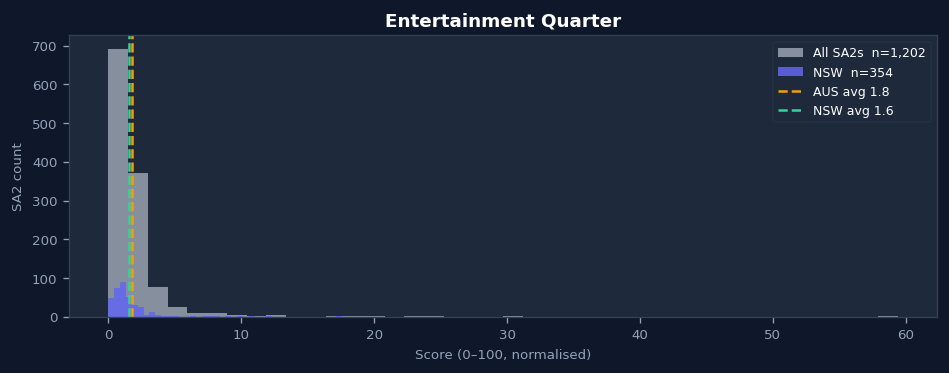

**Top 10 NSW**
| # | SA2 | LGA | Score |
|---|---|---|---|
| 1 | Pyrmont | Sydney | 17.6 |
| 2 | Southbank - East | Melbourne | 12.0 |
| 3 | Paddington - Moore Park | Sydney | 10.6 |
| 4 | Wentworth Point - Sydney Olympic Park | Parramatta | 9.9 |
| 5 | Mosman - South | Mosman | 9.9 |
| 6 | Doonside - Woodcroft | Blacktown | 8.9 |
| 7 | Jilliby - Yarramalong | Central Coast (NSW) | 8.0 |
| 8 | Moama | Murray River | 7.9 |
| 9 | Zetland | Sydney | 7.4 |
| 10 | Dubbo - West | Dubbo | 6.6 |

**Bottom 10 NSW**
| # | SA2 | LGA | Score |
|---|---|---|---|
| 1 | Blacktown - South | Blacktown | 0.0 |
| 2 | Banksmeadow | Bayside (NSW) | 0.0 |
| 3 | Smithfield Industrial | Cumberland | 0.1 |
| 4 | Liverpool - East | Liverpool | 0.1 |
| 5 | Chullora | Canterbury-Bankstown | 0.1 |
| 6 | Sydney Airport | Bayside (NSW) | 0.1 |
| 7 | Port Botany Industrial | Randwick | 0.1 |
| 8 | Pallara - Willawong | Brisbane | 0.1 |
| 9 | Chester Hill - Sefton | Canterbury-Bankstown | 0.2 |
| 10 | Hassall Grove - Plumpton | Blacktown | 0.2 |

---

### Healthcare Access
Clinics, hospitals, specialists and allied health measured by workers who commute here to do that work. High = you can actually see a doctor.
> **Calc:** W09B → `HC_SA_Tot_P` ÷ total POW workers (all industries W09A+B)
✅ **High:** GPs, bulk-billing clinics, allied health and specialists are actually here. Getting a Medicare rebate doesn't require a bus trip.
❌ **Low:** Limited local health services. When you're sick or injured, add travel time to the problem.
NSW avg: **16.0** | AUS avg: **16.0** | NSW range: 0.5–71.9
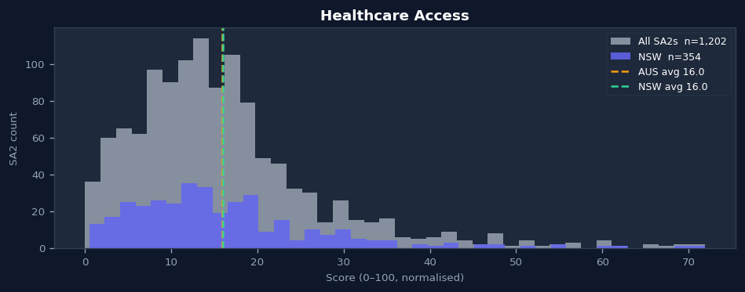

**Top 10 NSW**
| # | SA2 | LGA | Score |
|---|---|---|---|
| 1 | Northmead | Parramatta | 71.9 |
| 2 | Wollongong - West | Wollongong | 68.9 |
| 3 | Randwick - South | Randwick | 61.4 |
| 4 | Lambton - New Lambton | Newcastle | 61.1 |
| 5 | Kogarah | Georges River | 55.8 |
| 6 | Kingswood - Werrington | Penrith | 54.3 |
| 7 | Liverpool - East | Liverpool | 51.1 |
| 8 | Waratah - North Lambton | Newcastle | 48.4 |
| 9 | Campsie - South | Canterbury-Bankstown | 48.2 |
| 10 | Wahroonga (East) - Warrawee | Ku-ring-gai | 46.2 |

**Bottom 10 NSW**
| # | SA2 | LGA | Score |
|---|---|---|---|
| 1 | Chullora | Canterbury-Bankstown | 0.5 |
| 2 | Port Botany Industrial | Randwick | 0.5 |
| 3 | Port Kembla Industrial | Wollongong | 0.6 |
| 4 | Prospect Reservoir | Blacktown | 0.9 |
| 5 | Wetherill Park Industrial | Fairfield | 1.1 |
| 6 | Pallara - Willawong | Brisbane | 1.2 |
| 7 | Banksmeadow | Bayside (NSW) | 1.6 |
| 8 | Beresfield - Hexham | Newcastle | 1.7 |
| 9 | Pyrmont | Sydney | 1.8 |
| 10 | Sydney Airport | Bayside (NSW) | 1.9 |

---

### Education Hub
Schools, unis, tutoring centres measured by education workers showing up here daily. High = learning infrastructure is real.
> **Calc:** W09B → `EdTrn_Tot_P` ÷ total POW workers (all industries W09A+B)
✅ **High:** Real campus infrastructure, libraries and learning spaces are nearby — confirmed by the educators actually commuting in.
❌ **Low:** No real education infrastructure here. You're commuting to campus from a suburb that has nothing for you in between.
NSW avg: **11.7** | AUS avg: **11.9** | NSW range: 0.1–74.8
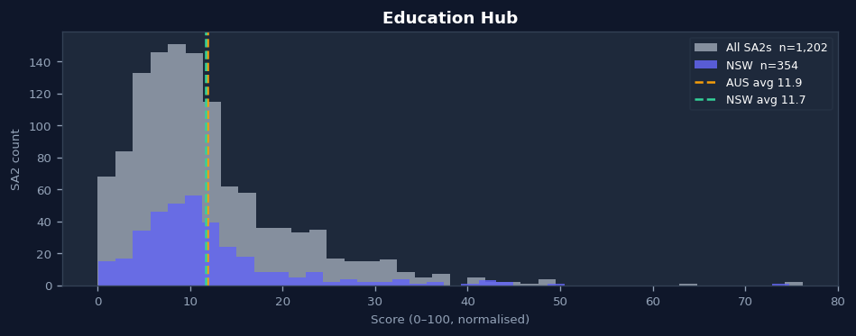

**Top 10 NSW**
| # | SA2 | LGA | Score |
|---|---|---|---|
| 1 | Kensington (NSW) | Randwick | 74.8 |
| 2 | Figtree - Keiraville | Wollongong | 49.3 |
| 3 | Shortland - Jesmond | Newcastle | 44.5 |
| 4 | Blacktown - South | Blacktown | 43.3 |
| 5 | Camperdown - Darlington | Sydney | 42.4 |
| 6 | Lurnea - Cartwright | Liverpool | 41.7 |
| 7 | Ultimo | Sydney | 41.6 |
| 8 | East Side | Alice Springs | 40.8 |
| 9 | Lethbridge Park - Tregear | Blacktown | 36.9 |
| 10 | Claymore - Eagle Vale - Raby | Campbelltown (NSW) | 36.8 |

**Bottom 10 NSW**
| # | SA2 | LGA | Score |
|---|---|---|---|
| 1 | Sydney Airport | Bayside (NSW) | 0.1 |
| 2 | Wetherill Park Industrial | Fairfield | 0.2 |
| 3 | Port Botany Industrial | Randwick | 0.2 |
| 4 | Port Kembla Industrial | Wollongong | 0.3 |
| 5 | Smithfield Industrial | Cumberland | 0.3 |
| 6 | Banksmeadow | Bayside (NSW) | 0.3 |
| 7 | Prospect Reservoir | Blacktown | 0.5 |
| 8 | Chullora | Canterbury-Bankstown | 0.6 |
| 9 | Silverwater - Newington | Parramatta | 1.1 |
| 10 | Rhodes | Canada Bay | 1.4 |

---

### Shops & Markets
Retail workers signal everyday convenience — grocery stores, markets, pharmacies, boutiques. High = you can run errands without leaving the area.
> **Calc:** W09A → `RetT_Tot_P` ÷ total POW workers (all industries W09A+B)
✅ **High:** Groceries, pharmacies, and everyday shops exist locally. Life is frictionless — you can run all your errands on foot.
❌ **Low:** Stock the fridge before you move in. Every errand is a car trip or a long walk to nowhere.
NSW avg: **10.2** | AUS avg: **10.8** | NSW range: 0.6–37.3
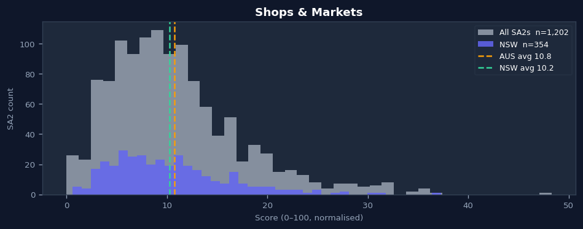

**Top 10 NSW**
| # | SA2 | LGA | Score |
|---|---|---|---|
| 1 | Castle Hill - North | The Hills | 37.3 |
| 2 | Adamstown - Kotara | Newcastle | 31.4 |
| 3 | Roselands | Canterbury-Bankstown | 30.7 |
| 4 | Miranda - Yowie Bay | Sutherland | 27.7 |
| 5 | Waterloo | Sydney | 27.7 |
| 6 | Rouse Hill - Beaumont Hills | The Hills | 26.7 |
| 7 | Tweed Heads South | Tweed | 24.9 |
| 8 | Sydenham - Tempe - St Peters | Inner West | 24.5 |
| 9 | Elderslie - Narellan | Camden | 24.5 |
| 10 | Winston Hills | Parramatta | 23.6 |

**Bottom 10 NSW**
| # | SA2 | LGA | Score |
|---|---|---|---|
| 1 | Port Kembla Industrial | Wollongong | 0.6 |
| 2 | Port Botany Industrial | Randwick | 0.7 |
| 3 | Wagga Wagga - North | Wagga Wagga | 1.0 |
| 4 | Camperdown - Darlington | Sydney | 1.4 |
| 5 | Strathfield - West | Strathfield | 1.5 |
| 6 | Melbourne CBD - West | Melbourne | 1.6 |
| 7 | Redfern | Sydney | 1.7 |
| 8 | Bathurst Surrounds | Bathurst | 1.7 |
| 9 | Wollongong - West | Wollongong | 2.3 |
| 10 | Seaham - Woodville | Port Stephens | 2.6 |

---

### Civic Infrastructure
Public Admin & Safety workers — councils, courts, emergency services. High = this is a real functioning neighbourhood, not just bedrooms.
> **Calc:** W09B → `PubAS_Tot_P` ÷ total POW workers (all industries W09A+B)
✅ **High:** Real services exist here — Centrelink, council offices, emergency services. The boring stuff works when you need it.
❌ **Low:** Bedroom suburb. Fine until something goes wrong and you realise there's nothing locally to help you sort it.
NSW avg: **5.5** | AUS avg: **5.8** | NSW range: 0.3–39.8
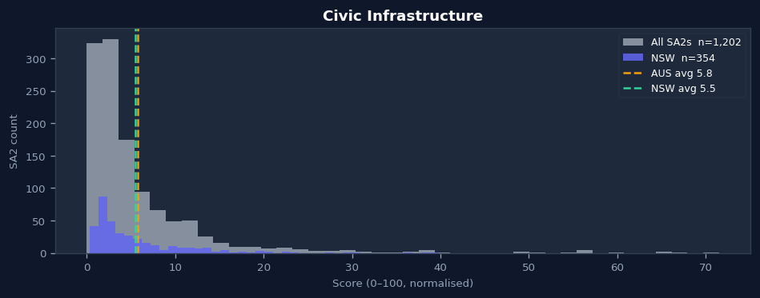

**Top 10 NSW**
| # | SA2 | LGA | Score |
|---|---|---|---|
| 1 | Williamtown - Medowie - Karuah | Port Stephens | 39.8 |
| 2 | Holsworthy - Wattle Grove | Liverpool | 38.2 |
| 3 | Parramatta - North | Parramatta | 35.9 |
| 4 | Yarramundi - Londonderry | Penrith | 30.7 |
| 5 | Potts Point - Woolloomooloo | Sydney | 29.3 |
| 6 | Queanbeyan Surrounds | Queanbeyan-Palerang | 27.0 |
| 7 | Ashfield - South | Inner West | 23.9 |
| 8 | Sydney (South) - Haymarket | Sydney | 22.2 |
| 9 | Bankstown - North | Canterbury-Bankstown | 22.1 |
| 10 | Hobart | Hobart | 20.6 |

**Bottom 10 NSW**
| # | SA2 | LGA | Score |
|---|---|---|---|
| 1 | Strathfield - East | Burwood | 0.3 |
| 2 | Horsley Park - Kemps Creek | Fairfield | 0.5 |
| 3 | Point Clare - Koolewong | Central Coast (NSW) | 0.5 |
| 4 | Strathfield South | Strathfield | 0.5 |
| 5 | Murwillumbah Surrounds | Tweed | 0.6 |
| 6 | Wahroonga (East) - Warrawee | Ku-ring-gai | 0.6 |
| 7 | Camperdown - Darlington | Sydney | 0.7 |
| 8 | Smithfield Industrial | Cumberland | 0.8 |
| 9 | Prestons | Liverpool | 0.8 |
| 10 | Dural - Kenthurst - Wisemans Ferry | The Hills | 0.8 |

---

### Knowledge Economy Hub
Professional/Scientific/Tech + Finance workers flowing IN. High = high-value employers are here. Great for placement, networking, internships.
> **Calc:** W09B → (`ProSTS_Tot_P` + `FinIns_Tot_P`) ÷ total POW workers (all industries W09A+B)
✅ **High:** High-value employers are physically here. Internships, grad jobs, and industry connections are within commuting reach — or even walking distance.
❌ **Low:** Professionals commute away from here to work. Fewer local career opportunities and less chance of running into people in your field.
NSW avg: **9.8** | AUS avg: **8.8** | NSW range: 0.5–63.6
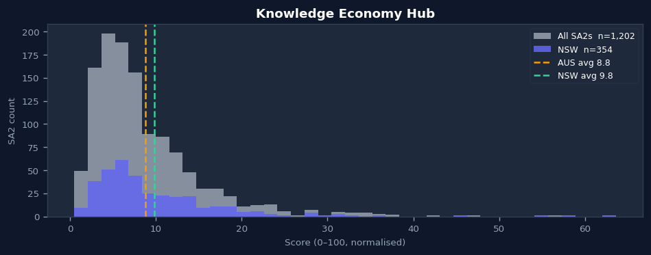

**Top 10 NSW**
| # | SA2 | LGA | Score |
|---|---|---|---|
| 1 | Sydney (North) - Millers Point | Sydney | 63.6 |
| 2 | Redfern | Sydney | 57.8 |
| 3 | Melbourne CBD - West | Melbourne | 54.7 |
| 4 | North Sydney - Lavender Bay | North Sydney | 45.2 |
| 5 | Pyrmont | Sydney | 35.6 |
| 6 | Surry Hills | Sydney | 33.4 |
| 7 | Newcastle - Cooks Hill | Newcastle | 31.9 |
| 8 | Sydney (South) - Haymarket | Sydney | 31.6 |
| 9 | Chippendale | Sydney | 30.5 |
| 10 | Menai - Lucas Heights - Woronora | Sutherland | 29.9 |

**Bottom 10 NSW**
| # | SA2 | LGA | Score |
|---|---|---|---|
| 1 | Sydney Airport | Bayside (NSW) | 0.5 |
| 2 | Barkly | Barkly | 0.8 |
| 3 | Port Kembla Industrial | Wollongong | 1.5 |
| 4 | Corowa Surrounds | Federation | 1.5 |
| 5 | Port Botany Industrial | Randwick | 1.6 |
| 6 | Tamworth - West | Tamworth | 1.7 |
| 7 | Mudgee Surrounds - West | Mid-Western | 1.9 |
| 8 | Pallara - Willawong | Brisbane | 2.0 |
| 9 | Junee | Junee | 2.0 |
| 10 | Prospect Reservoir | Blacktown | 2.2 |

---

### Job Gravity
More jobs exist here than workers who live here. Score > 50 = area pulls people in. < 50 = people leave every morning to go elsewhere.
> **Calc:** W01A (sum M_+F_ `_Tot` cols = total POW workers) ÷ G43 `lfs_Tot_LF_P` → log₂ scaled to 0–100
✅ **High:** More jobs exist here than residents. The area attracts workers — bustling by day, more opportunity to pick up casual shifts or network with people in your field.
❌ **Low:** Everyone leaves every morning. Bedroom suburb that only comes alive on weekends — and even then, maybe not.
NSW avg: **47.7** | AUS avg: **47.8** | NSW range: 24.0–100.0
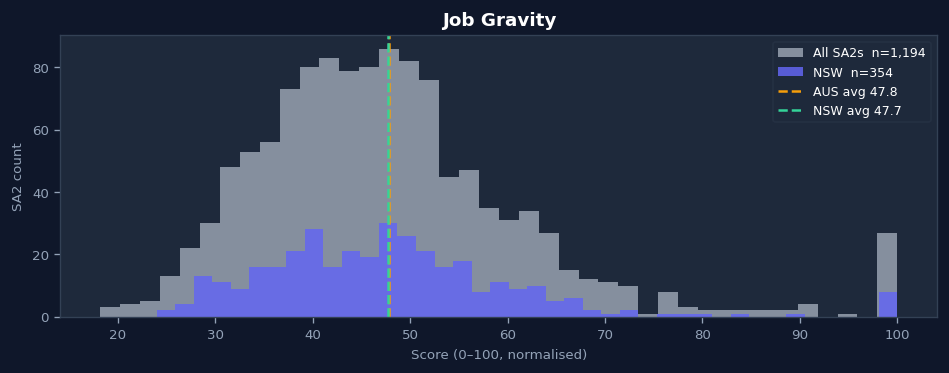

**Top 10 NSW**
| # | SA2 | LGA | Score |
|---|---|---|---|
| 1 | Sydney (North) - Millers Point | Sydney | 100.0 |
| 2 | Port Kembla Industrial | Wollongong | 100.0 |
| 3 | Smithfield Industrial | Cumberland | 100.0 |
| 4 | Wetherill Park Industrial | Fairfield | 100.0 |
| 5 | Sydney Airport | Bayside (NSW) | 100.0 |
| 6 | Port Botany Industrial | Randwick | 100.0 |
| 7 | Prospect Reservoir | Blacktown | 100.0 |
| 8 | Banksmeadow | Bayside (NSW) | 98.5 |
| 9 | Chullora | Canterbury-Bankstown | 89.1 |
| 10 | Melbourne CBD - West | Melbourne | 83.4 |

**Bottom 10 NSW**
| # | SA2 | LGA | Score |
|---|---|---|---|
| 1 | Lethbridge Park - Tregear | Blacktown | 24.0 |
| 2 | Blacktown - South | Blacktown | 25.8 |
| 3 | Valentine - Eleebana | Lake Macquarie | 26.3 |
| 4 | South Wentworthville | Cumberland | 26.6 |
| 5 | Doonside - Woodcroft | Blacktown | 27.0 |
| 6 | Quakers Hill | Blacktown | 27.1 |
| 7 | Castle Hill - West | The Hills | 27.9 |
| 8 | West Pennant Hills | The Hills | 28.1 |
| 9 | Wiley Park | Canterbury-Bankstown | 28.1 |
| 10 | North Kellyville | The Hills | 28.1 |

---

## Academic & Job Opportunity

### Qualification Density
% of residents (15+) with a bachelor's degree or higher. High = educated neighbourhood.
> **Calc:** G49B → (`P_PGrad_Deg_Total` + `P_GradDip_and_GradCert_Total` + `P_BachDeg_Total`) ÷ `P_Tot_Total`
✅ **High:** Educated neighbourhood — good local amenities, coffee-shop conversations with substance, and people who take their careers seriously.
❌ **Low:** Fewer locals with university backgrounds. Can feel intellectually quieter — but also less competitive and more affordable.
NSW avg: **43.0** | AUS avg: **41.1** | NSW range: 0.0–75.3
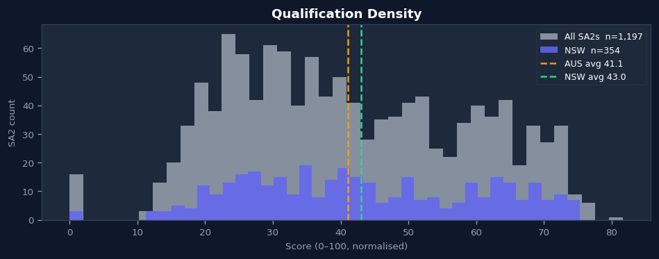

**Top 10 NSW**
| # | SA2 | LGA | Score |
|---|---|---|---|
| 1 | Greenwich - Riverview | Lane Cove | 75.3 |
| 2 | Pymble | Ku-ring-gai | 74.9 |
| 3 | Rhodes | Canada Bay | 74.7 |
| 4 | Lindfield - Roseville | Ku-ring-gai | 74.4 |
| 5 | Crows Nest - Waverton | North Sydney | 74.1 |
| 6 | St Leonards - Naremburn | North Sydney | 73.8 |
| 7 | Paddington - Moore Park | Sydney | 73.8 |
| 8 | Gordon - Killara | Ku-ring-gai | 73.2 |
| 9 | Parramatta - North | Parramatta | 73.1 |
| 10 | Camperdown - Darlington | Sydney | 73.1 |

**Bottom 10 NSW**
| # | SA2 | LGA | Score |
|---|---|---|---|
| 1 | Port Kembla Industrial | Wollongong | 0.0 |
| 2 | Smithfield Industrial | Cumberland | 0.0 |
| 3 | Port Botany Industrial | Randwick | 0.0 |
| 4 | Tamworth - West | Tamworth | 12.4 |
| 5 | Cessnock | Cessnock | 12.5 |
| 6 | Yarramundi - Londonderry | Penrith | 13.1 |
| 7 | Barkly | Barkly | 13.4 |
| 8 | Kempsey | Kempsey | 13.7 |
| 9 | Kurri Kurri - Abermain | Cessnock | 14.5 |
| 10 | Junee | Junee | 15.3 |

---

### Grad Capture Rate
% of 25–34 year olds who hold a post-school qualification. High = area retains graduates.
> **Calc:** G49B → (`P_BachDeg_25_34` + `P_GradDip_and_GradCert_25_34` + `P_AdvDip_and_Dip_25_34` + `P_Cert_III_IV_25_34` + `P_Cert_I_II_25_34`) ÷ `P_Tot_25_34`
✅ **High:** People who graduate here tend to stay. Sign of a city or region with real jobs, real lifestyle, and a reason to stick around after commencement.
❌ **Low:** Graduates leave. The area is a launchpad, not a destination — use it to get qualified, then expect to move on.
NSW avg: **74.4** | AUS avg: **75.2** | NSW range: 0.0–91.9
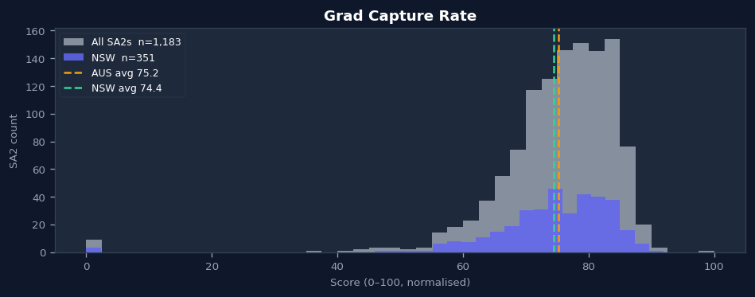

**Top 10 NSW**
| # | SA2 | LGA | Score |
|---|---|---|---|
| 1 | Seaham - Woodville | Port Stephens | 91.9 |
| 2 | Thornton - Millers Forest | Maitland | 88.4 |
| 3 | Laurieton - Bonny Hills | Port Macquarie-Hastings | 88.3 |
| 4 | Williamtown - Medowie - Karuah | Port Stephens | 88.2 |
| 5 | Kincumber - Picketts Valley | Central Coast (NSW) | 88.1 |
| 6 | Maitland | Maitland | 87.6 |
| 7 | Bayview - Elanora Heights | Northern Beaches | 87.5 |
| 8 | Engadine | Sutherland | 87.1 |
| 9 | Tomerong - Wandandian - Woollamia | Shoalhaven | 87.0 |
| 10 | Kurri Kurri - Abermain | Cessnock | 87.0 |

**Bottom 10 NSW**
| # | SA2 | LGA | Score |
|---|---|---|---|
| 1 | Wetherill Park Industrial | Fairfield | 0.0 |
| 2 | Sydney Airport | Bayside (NSW) | 0.0 |
| 3 | Prospect Reservoir | Blacktown | 0.0 |
| 4 | Yarramundi - Londonderry | Penrith | 46.1 |
| 5 | Silverwater - Newington | Parramatta | 48.7 |
| 6 | Junee | Junee | 51.8 |
| 7 | Grafton Surrounds | Clarence Valley | 55.1 |
| 8 | Rosehill - Harris Park | Parramatta | 55.3 |
| 9 | Lakemba | Canterbury-Bankstown | 55.3 |
| 10 | Parramatta - South | Parramatta | 56.6 |

---

### Professional Job Density
% of employed workers in manager or professional roles. High = quality jobs nearby.
> **Calc:** G60B → (`P_Tot_Managers` + `P_Tot_Professionals`) ÷ `P_Tot_Tot`
✅ **High:** Career-track jobs exist here. You don't have to commute to the CBD to find something in your field after graduation.
❌ **Low:** Fewer professional roles in the local job market. A graduate role will likely require a significant commute.
NSW avg: **39.7** | AUS avg: **37.6** | NSW range: 0.0–70.4
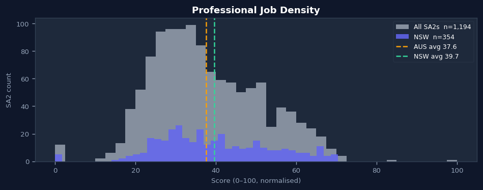

**Top 10 NSW**
| # | SA2 | LGA | Score |
|---|---|---|---|
| 1 | Balmain | Inner West | 70.4 |
| 2 | Paddington - Moore Park | Sydney | 70.3 |
| 3 | St Leonards - Naremburn | North Sydney | 69.6 |
| 4 | North Sydney - Lavender Bay | North Sydney | 69.6 |
| 5 | Double Bay - Darling Point | Woollahra | 69.4 |
| 6 | Crows Nest - Waverton | North Sydney | 68.3 |
| 7 | Greenwich - Riverview | Lane Cove | 67.7 |
| 8 | Erskineville - Alexandria | Sydney | 67.5 |
| 9 | Mosman - South | Mosman | 67.5 |
| 10 | Darlinghurst | Sydney | 66.5 |

**Bottom 10 NSW**
| # | SA2 | LGA | Score |
|---|---|---|---|
| 1 | Port Kembla Industrial | Wollongong | 0.0 |
| 2 | Smithfield Industrial | Cumberland | 0.0 |
| 3 | Wetherill Park Industrial | Fairfield | 0.0 |
| 4 | Port Botany Industrial | Randwick | 0.0 |
| 5 | Prospect Reservoir | Blacktown | 0.0 |
| 6 | Tamworth - West | Tamworth | 14.8 |
| 7 | Beresfield - Hexham | Newcastle | 16.9 |
| 8 | Muswellbrook | Muswellbrook | 17.2 |
| 9 | Kurri Kurri - Abermain | Cessnock | 17.7 |
| 10 | Auburn - North | Cumberland | 18.0 |

---

### STEM Field Concentration
% of qualified residents whose field was STEM. High = tech and science ecosystem.
> **Calc:** G50A → M+F (`NatPhyl_Scn` + `InfoTech` + `Eng_RelTec` + `ArchtBldng`) `_Tot` ÷ sum all field `_Tot` M+F
✅ **High:** Tech and science cluster — your neighbours include engineers, developers and researchers. Networking, internships, and industry events are more accessible.
❌ **Low:** Not a STEM cluster. Peers in technical fields are scattered elsewhere — relevant if your degree is engineering, computing, or science.
NSW avg: **36.8** | AUS avg: **36.8** | NSW range: 0.0–57.1
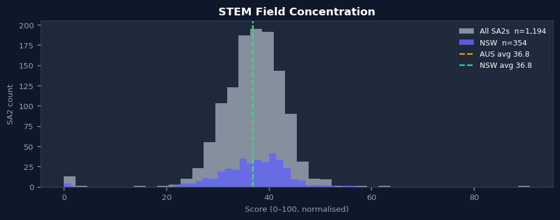

**Top 10 NSW**
| # | SA2 | LGA | Score |
|---|---|---|---|
| 1 | Wetherill Park Industrial | Fairfield | 57.1 |
| 2 | Parramatta - North | Parramatta | 55.3 |
| 3 | Parramatta - South | Parramatta | 52.0 |
| 4 | Horsley Park - Kemps Creek | Fairfield | 50.5 |
| 5 | Pitt Town - McGraths Hill | Hawkesbury | 50.5 |
| 6 | Schofields - East | Blacktown | 49.5 |
| 7 | Singleton | Singleton | 48.9 |
| 8 | Williamtown - Medowie - Karuah | Port Stephens | 48.1 |
| 9 | The Oaks - Oakdale | Wollondilly | 47.9 |
| 10 | Rosehill - Harris Park | Parramatta | 46.9 |

**Bottom 10 NSW**
| # | SA2 | LGA | Score |
|---|---|---|---|
| 1 | Smithfield Industrial | Cumberland | 0.0 |
| 2 | Sydney Airport | Bayside (NSW) | 0.0 |
| 3 | Port Botany Industrial | Randwick | 0.0 |
| 4 | Prospect Reservoir | Blacktown | 0.0 |
| 5 | Darlinghurst | Sydney | 21.5 |
| 6 | Junee | Junee | 22.3 |
| 7 | Paddington - Moore Park | Sydney | 23.5 |
| 8 | Armidale Surrounds - North | Armidale | 23.7 |
| 9 | Potts Point - Woolloomooloo | Sydney | 23.8 |
| 10 | Double Bay - Darling Point | Woollahra | 23.9 |

---

### Income Growth Signal
% of 15+ population earning $1,500+/week. High = strong earning potential in the area.
> **Calc:** G17A → M+F (`1500_1749` + `1750_1999` + `2000_2999` + `3000_3499` + `3500_more`) ÷ `M_Tot_Tot` + `F_Tot_Tot`
✅ **High:** The job market here rewards skills and experience. Strong earning potential once you're qualified and working full-time.
❌ **Low:** Fewer high-income earners locally. Could reflect a casualised or low-wage job market — worth knowing before you plan your post-grad finances.
NSW avg: **29.7** | AUS avg: **29.3** | NSW range: 0.0–59.4
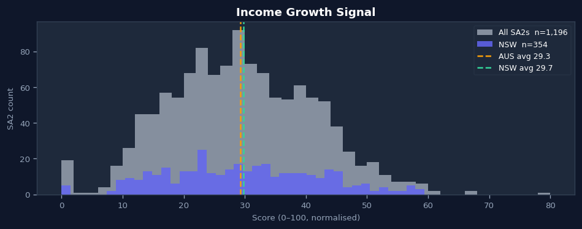

**Top 10 NSW**
| # | SA2 | LGA | Score |
|---|---|---|---|
| 1 | Double Bay - Darling Point | Woollahra | 59.4 |
| 2 | St Leonards - Naremburn | North Sydney | 58.9 |
| 3 | North Sydney - Lavender Bay | North Sydney | 58.8 |
| 4 | Crows Nest - Waverton | North Sydney | 57.7 |
| 5 | Manly - Fairlight | Northern Beaches | 57.4 |
| 6 | Erskineville - Alexandria | Sydney | 57.4 |
| 7 | Mosman - South | Mosman | 56.8 |
| 8 | Paddington - Moore Park | Sydney | 56.5 |
| 9 | Mosman - North | Mosman | 55.0 |
| 10 | Balmain | Inner West | 55.0 |

**Bottom 10 NSW**
| # | SA2 | LGA | Score |
|---|---|---|---|
| 1 | Port Kembla Industrial | Wollongong | 0.0 |
| 2 | Wetherill Park Industrial | Fairfield | 0.0 |
| 3 | Sydney Airport | Bayside (NSW) | 0.0 |
| 4 | Port Botany Industrial | Randwick | 0.0 |
| 5 | Prospect Reservoir | Blacktown | 0.0 |
| 6 | Auburn - North | Cumberland | 8.4 |
| 7 | Nambucca Heads | Nambucca Valley | 8.5 |
| 8 | Kempsey | Kempsey | 9.1 |
| 9 | Cabramatta - Lansvale | Fairfield | 9.3 |
| 10 | Fairfield | Fairfield | 9.3 |

---

### Employment Rate
Employment-to-population ratio for 15+ year olds. High = jobs are plentiful.
> **Calc:** G43 → `Percnt_Employment_to_populn_P` (pre-computed ratio, used directly)
✅ **High:** Jobs are easy to find here — both casual work while you're studying and full-time roles after graduation.
❌ **Low:** Tighter local job market. Harder to pick up shifts or land that first role without competing hard or commuting further.
NSW avg: **56.7** | AUS avg: **58.3** | NSW range: 28.7–78.8
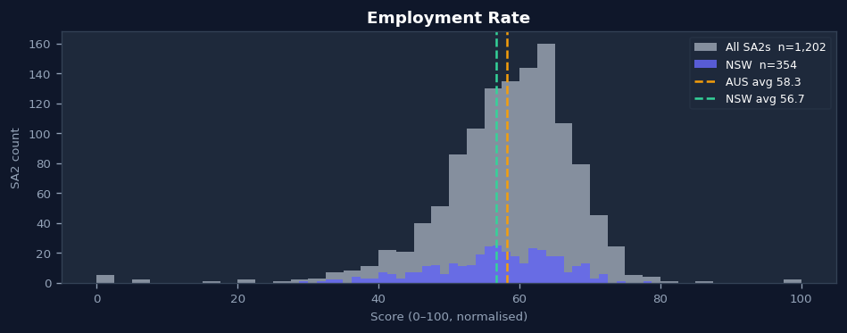

**Top 10 NSW**
| # | SA2 | LGA | Score |
|---|---|---|---|
| 1 | Erskineville - Alexandria | Sydney | 78.8 |
| 2 | Southbank - East | Melbourne | 74.3 |
| 3 | St Leonards - Naremburn | North Sydney | 72.5 |
| 4 | Pallara - Willawong | Brisbane | 72.0 |
| 5 | Newtown (NSW) | Sydney | 71.6 |
| 6 | Gledswood Hills - Gregory Hills | Camden | 71.6 |
| 7 | Port Botany Industrial | Randwick | 71.4 |
| 8 | Crows Nest - Waverton | North Sydney | 71.3 |
| 9 | Jordan Springs - Llandilo | Penrith | 71.1 |
| 10 | North Kellyville | The Hills | 70.6 |

**Bottom 10 NSW**
| # | SA2 | LGA | Score |
|---|---|---|---|
| 1 | Fairfield | Fairfield | 28.7 |
| 2 | Lurnea - Cartwright | Liverpool | 32.1 |
| 3 | Guildford - South Granville | Cumberland | 32.5 |
| 4 | Fairfield - East | Fairfield | 33.5 |
| 5 | Nambucca Heads | Nambucca Valley | 34.4 |
| 6 | Liverpool - West | Liverpool | 34.5 |
| 7 | Cabramatta - Lansvale | Fairfield | 36.7 |
| 8 | Lakemba | Canterbury-Bankstown | 36.8 |
| 9 | Smithfield - Wetherill Park | Fairfield | 37.0 |
| 10 | Chester Hill - Sefton | Canterbury-Bankstown | 37.2 |

---

### Mortgage Stress
% of mortgaged dwellings paying $3,000+/month. High = expensive to buy here. ⚠️ High is bad.
> **Calc:** G38 → (`M_3000_3999_Tot` + `M_4000_over_Tot`) ÷ `Tot_Tot`
✅ **Low:** Housing is relatively affordable to buy here. The property ladder exists — though you're probably still renting for now.
❌ **High:** Extremely expensive to own property. The deposit required is enormous. Long-term renting is likely your reality here — budget accordingly.
NSW avg: **26.7** | AUS avg: **19.2** | NSW range: 0.0–100.0
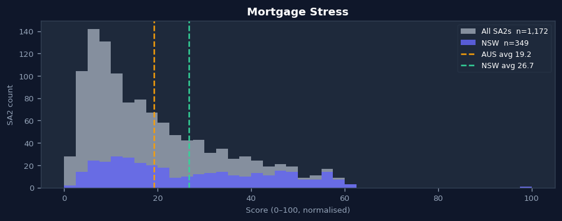

**Top 10 NSW**
| # | SA2 | LGA | Score |
|---|---|---|---|
| 1 | Port Botany Industrial | Randwick | 100.0 |
| 2 | Balmain | Inner West | 61.5 |
| 3 | Lilli Pilli - Port Hacking - Dolans Bay | Sutherland | 61.4 |
| 4 | Balgowlah - Clontarf - Seaforth | Northern Beaches | 61.1 |
| 5 | Lilyfield - Rozelle | Inner West | 59.7 |
| 6 | Paddington - Moore Park | Sydney | 59.0 |
| 7 | Mosman - South | Mosman | 58.6 |
| 8 | North Kellyville | The Hills | 58.4 |
| 9 | Wahroonga (East) - Warrawee | Ku-ring-gai | 58.3 |
| 10 | Leichhardt | Inner West | 58.2 |

**Bottom 10 NSW**
| # | SA2 | LGA | Score |
|---|---|---|---|
| 1 | Barkly | Barkly | 0.0 |
| 2 | Broken Hill | Broken Hill | 2.1 |
| 3 | Cowra | Cowra | 3.2 |
| 4 | Lavington | Albury | 3.2 |
| 5 | Albury - North | Albury | 3.5 |
| 6 | Lismore | Lismore | 3.6 |
| 7 | Inverell | Inverell | 3.7 |
| 8 | Shortland - Jesmond | Newcastle | 3.7 |
| 9 | Kempsey | Kempsey | 3.8 |
| 10 | Slacks Creek | Logan | 3.8 |

---

## Meme Metrics — Ages 18–34
Culturally-framed signals targeting student life, early career, housing independence, relationships, and the kind of things that go viral on Reddit. Composites blend existing vibe/POW/student scores with new age-specific Census data.

### Uni Town Index
Full-time tertiary students aged 15–24 as % of all enrolled students. High = genuine university town, not just adult ed.
> **Calc:** G15 → (`Tert_Uni_oth_h_edu_Ft_15_24_P` + `Tert_Voc_edu_Ft_15_24_P`) ÷ `Tot_P`
✅ **High:** This place IS a uni town — student discounts are real, campus life is active, and everything bends around the academic calendar.
❌ **Low:** Students are a small minority here. The suburb doesn't know or care about O-Week.
NSW avg: **9.3** | AUS avg: **9.2** | NSW range: 0.0–48.6
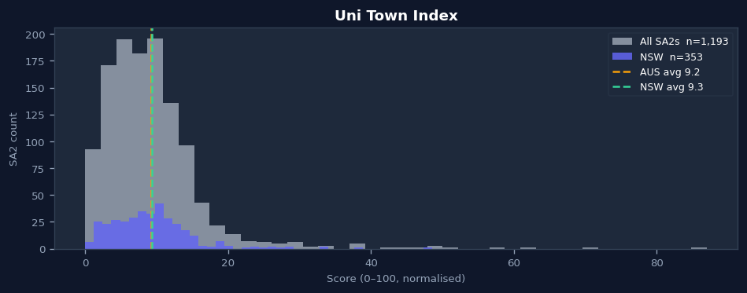

**Top 10 NSW**
| # | SA2 | LGA | Score |
|---|---|---|---|
| 1 | Camperdown - Darlington | Sydney | 48.6 |
| 2 | Chippendale | Sydney | 37.7 |
| 3 | Kensington (NSW) | Randwick | 33.7 |
| 4 | Shortland - Jesmond | Newcastle | 33.2 |
| 5 | Melbourne CBD - West | Melbourne | 29.1 |
| 6 | Zetland | Sydney | 29.0 |
| 7 | Wagga Wagga - North | Wagga Wagga | 27.4 |
| 8 | Ultimo | Sydney | 26.4 |
| 9 | Strathfield - East | Burwood | 26.2 |
| 10 | Burwood (NSW) | Burwood | 24.5 |

**Bottom 10 NSW**
| # | SA2 | LGA | Score |
|---|---|---|---|
| 1 | Smithfield Industrial | Cumberland | 0.0 |
| 2 | Wetherill Park Industrial | Fairfield | 0.0 |
| 3 | Sydney Airport | Bayside (NSW) | 0.0 |
| 4 | Port Botany Industrial | Randwick | 0.0 |
| 5 | Prospect Reservoir | Blacktown | 0.0 |
| 6 | Tamworth - West | Tamworth | 1.1 |
| 7 | Mullumbimby | Byron | 1.4 |
| 8 | Nyngan - Warren | Bogan | 1.5 |
| 9 | Batemans Bay | Eurobodalla | 1.5 |
| 10 | Barkly | Barkly | 1.5 |

---

### Ramen Economy Score
Composite: student density + renters + low-income youth. High = peak broke-but-happy energy.
> **Calc:** Composite → mean(`student_bubble_pct_norm`, `renter_republic_pct_norm`, `low_income_youth_pct_norm`)
✅ **High:** Classic student-poverty energy — cheap eats, flat shares everywhere, and solidarity in being collectively broke.
❌ **Low:** More expensive and professionally oriented. Your budget constraints will feel out of step with the neighbourhood.
NSW avg: **32.1** | AUS avg: **31.9** | NSW range: 0.0–69.8
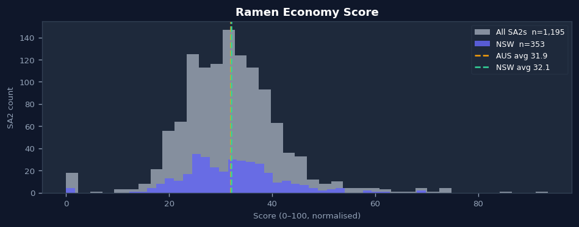

**Top 10 NSW**
| # | SA2 | LGA | Score |
|---|---|---|---|
| 1 | Chippendale | Sydney | 69.8 |
| 2 | Camperdown - Darlington | Sydney | 68.2 |
| 3 | Melbourne CBD - West | Melbourne | 61.1 |
| 4 | Zetland | Sydney | 60.3 |
| 5 | Kensington (NSW) | Randwick | 59.2 |
| 6 | Ultimo | Sydney | 58.4 |
| 7 | Southbank - East | Melbourne | 54.0 |
| 8 | Hobart | Hobart | 53.5 |
| 9 | Waterloo | Sydney | 52.9 |
| 10 | Macquarie Park - Marsfield | Ryde | 52.7 |

**Bottom 10 NSW**
| # | SA2 | LGA | Score |
|---|---|---|---|
| 1 | Smithfield Industrial | Cumberland | 0.0 |
| 2 | Sydney Airport | Bayside (NSW) | 0.0 |
| 3 | Port Botany Industrial | Randwick | 0.0 |
| 4 | Prospect Reservoir | Blacktown | 0.0 |
| 5 | Corowa Surrounds | Federation | 13.4 |
| 6 | Dorrigo | Bellingen | 14.6 |
| 7 | Junee | Junee | 15.8 |
| 8 | Yarramundi - Londonderry | Penrith | 16.7 |
| 9 | Queanbeyan Surrounds | Queanbeyan-Palerang | 17.3 |
| 10 | Tomerong - Wandandian - Woollamia | Shoalhaven | 17.4 |

---

### Sharehouse Capital
Group household members aged 15–34 as % of 15–34 population. High = rotating housemates, mystery leftovers, and bathroom rosters.
> **Calc:** G27B (`P_GrpH_Mem_15_24` + `P_GrpH_Mem_25_34`) ÷ G04A (`Age_yr_15_19_P` + `Age_yr_20_24_P` + `Age_yr_25_29_P` + `Age_yr_30_34_P`)
✅ **High:** Share houses are the norm. Finding housemates is easy, landlords expect it, and the culture fully supports living with strangers.
❌ **Low:** Most people live with family or as couples. Share house listings are sparse — you'll fight for every room on Flatmates.
NSW avg: **7.6** | AUS avg: **8.1** | NSW range: 0.0–30.8
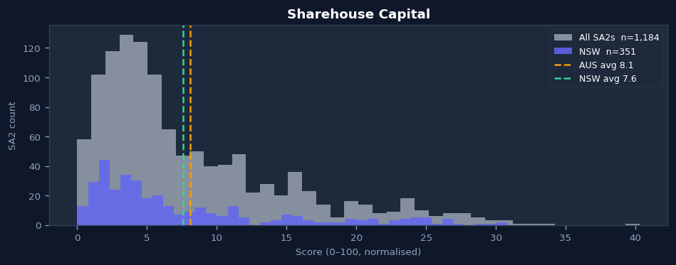

**Top 10 NSW**
| # | SA2 | LGA | Score |
|---|---|---|---|
| 1 | Newtown (NSW) | Sydney | 30.8 |
| 2 | Strathfield - East | Burwood | 30.5 |
| 3 | Redfern | Sydney | 30.0 |
| 4 | Sydney (South) - Haymarket | Sydney | 28.7 |
| 5 | Ultimo | Sydney | 27.7 |
| 6 | Surry Hills | Sydney | 26.8 |
| 7 | Wollongong - East | Wollongong | 26.8 |
| 8 | Melbourne CBD - West | Melbourne | 26.3 |
| 9 | Burwood (NSW) | Burwood | 26.2 |
| 10 | Coburg - East | Merri-bek | 25.6 |

**Bottom 10 NSW**
| # | SA2 | LGA | Score |
|---|---|---|---|
| 1 | Tomerong - Wandandian - Woollamia | Shoalhaven | 0.0 |
| 2 | Wetherill Park Industrial | Fairfield | 0.0 |
| 3 | Sydney Airport | Bayside (NSW) | 0.0 |
| 4 | Prospect Reservoir | Blacktown | 0.0 |
| 5 | Seaham - Woodville | Port Stephens | 0.0 |
| 6 | Jilliby - Yarramalong | Central Coast (NSW) | 0.0 |
| 7 | Horsley Park - Kemps Creek | Fairfield | 0.3 |
| 8 | Castle Hill - West | The Hills | 0.5 |
| 9 | Hinchinbrook | Liverpool | 0.5 |
| 10 | Douglas Park - Appin | Wollondilly | 0.6 |

---

### All-Nighter Index
Composite: student density + night economy. High = somewhere between study mode and 3am kebab runs.
> **Calc:** Composite → mean(`student_bubble_pct_norm`, `night_economy_pct_norm`)
✅ **High:** The area has both the student intensity and the late-night options to sustain a proper all-nighter — study session or social, your call.
❌ **Low:** Quiet suburb. Lights go out early. Nobody is awake at 2am and there's nowhere open if they were.
NSW avg: **10.3** | AUS avg: **10.4** | NSW range: 0.0–31.6
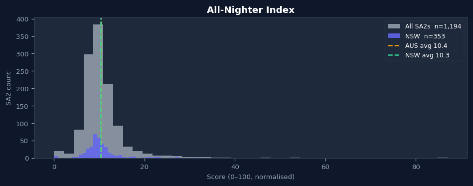

**Top 10 NSW**
| # | SA2 | LGA | Score |
|---|---|---|---|
| 1 | Camperdown - Darlington | Sydney | 31.6 |
| 2 | Chippendale | Sydney | 27.4 |
| 3 | Melbourne CBD - West | Melbourne | 27.3 |
| 4 | Shortland - Jesmond | Newcastle | 25.3 |
| 5 | Ultimo | Sydney | 23.6 |
| 6 | Kensington (NSW) | Randwick | 23.6 |
| 7 | Sydney (South) - Haymarket | Sydney | 22.5 |
| 8 | Strathfield - East | Burwood | 22.4 |
| 9 | Southbank - East | Melbourne | 21.4 |
| 10 | Burwood (NSW) | Burwood | 21.0 |

**Bottom 10 NSW**
| # | SA2 | LGA | Score |
|---|---|---|---|
| 1 | Smithfield Industrial | Cumberland | 0.0 |
| 2 | Wetherill Park Industrial | Fairfield | 0.0 |
| 3 | Sydney Airport | Bayside (NSW) | 0.0 |
| 4 | Port Botany Industrial | Randwick | 0.0 |
| 5 | Prospect Reservoir | Blacktown | 0.0 |
| 6 | Armidale Surrounds - North | Armidale | 4.0 |
| 7 | Inverell Surrounds - West | Gwydir | 4.4 |
| 8 | Junee | Junee | 5.0 |
| 9 | Nyngan - Warren | Bogan | 5.4 |
| 10 | Tamworth Surrounds | Tamworth | 5.8 |

---

### First Job Energy
Employment rate (%) of 20–24 year olds in the labour force. High = young people here are actually finding work — not just vibing.
> **Calc:** G46A → (`M_Tot_Emp_20_24` + `F_Tot_Emp_20_24`) ÷ (`M_Tot_LF_20_24` + `F_Tot_Emp_20_24` + `F_Tot_Unemp_20_24`)
✅ **High:** 20–24 year olds are actually employed here. The local job market is working for people your age — casual shifts and grad roles alike.
❌ **Low:** Youth unemployment is higher here. Competition for entry-level roles is real, and finding casual work while studying is genuinely hard.
NSW avg: **91.9** | AUS avg: **91.8** | NSW range: 81.3–100.0
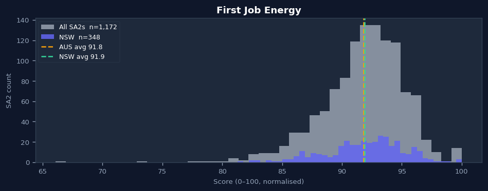

**Top 10 NSW**
| # | SA2 | LGA | Score |
|---|---|---|---|
| 1 | Horsley Park - Kemps Creek | Fairfield | 100.0 |
| 2 | Lilli Pilli - Port Hacking - Dolans Bay | Sutherland | 100.0 |
| 3 | Banksmeadow | Bayside (NSW) | 100.0 |
| 4 | Braidwood | Queanbeyan-Palerang | 98.9 |
| 5 | Nyngan - Warren | Bogan | 98.3 |
| 6 | Douglas Park - Appin | Wollondilly | 98.0 |
| 7 | Belrose | Northern Beaches | 97.6 |
| 8 | Bayview - Elanora Heights | Northern Beaches | 97.3 |
| 9 | The Oaks - Oakdale | Wollondilly | 97.2 |
| 10 | Frenchs Forest - Oxford Falls | Northern Beaches | 97.1 |

**Bottom 10 NSW**
| # | SA2 | LGA | Score |
|---|---|---|---|
| 1 | Lakemba | Canterbury-Bankstown | 81.3 |
| 2 | Tamworth - West | Tamworth | 82.3 |
| 3 | Dorrigo | Bellingen | 82.6 |
| 4 | Hobart | Hobart | 82.8 |
| 5 | Chippendale | Sydney | 82.9 |
| 6 | Ultimo | Sydney | 83.8 |
| 7 | Fairfield | Fairfield | 83.8 |
| 8 | Regents Park | Canterbury-Bankstown | 84.3 |
| 9 | Tomerong - Wandandian - Woollamia | Shoalhaven | 84.8 |
| 10 | Punchbowl | Canterbury-Bankstown | 85.3 |

---

### Promotion Pipeline
Managers + professionals aged 25–34 as % of all 25–34 employed. High = fast-track territory — people here are already running things.
> **Calc:** G60B → (`P25_34_Managers` + `P25_34_Professionals`) ÷ `P25_34_Tot`
✅ **High:** People in their late 20s and early 30s are already in management and professional roles here. A signal that the career trajectory is steep and achievable.
❌ **Low:** The local workforce skews toward trades, admin, or service roles. Career progression will likely require commuting further afield.
NSW avg: **42.3** | AUS avg: **39.2** | NSW range: 0.0–73.4
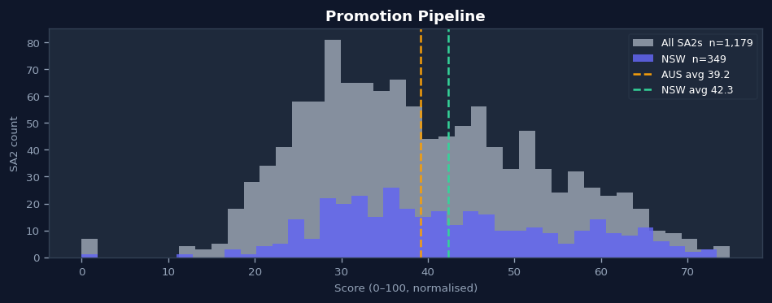

**Top 10 NSW**
| # | SA2 | LGA | Score |
|---|---|---|---|
| 1 | Double Bay - Darling Point | Woollahra | 73.4 |
| 2 | Paddington - Moore Park | Sydney | 72.6 |
| 3 | St Leonards - Naremburn | North Sydney | 71.7 |
| 4 | North Sydney - Lavender Bay | North Sydney | 70.8 |
| 5 | Crows Nest - Waverton | North Sydney | 70.3 |
| 6 | Erskineville - Alexandria | Sydney | 69.2 |
| 7 | Balmain | Inner West | 68.3 |
| 8 | Manly - Fairlight | Northern Beaches | 68.2 |
| 9 | Surry Hills | Sydney | 67.9 |
| 10 | Glebe - Forest Lodge | Sydney | 67.5 |

**Bottom 10 NSW**
| # | SA2 | LGA | Score |
|---|---|---|---|
| 1 | Wetherill Park Industrial | Fairfield | 0.0 |
| 2 | Tamworth - West | Tamworth | 11.7 |
| 3 | Muswellbrook | Muswellbrook | 18.1 |
| 4 | Cessnock | Cessnock | 18.3 |
| 5 | Kurri Kurri - Abermain | Cessnock | 18.3 |
| 6 | Junee | Junee | 20.0 |
| 7 | Beresfield - Hexham | Newcastle | 20.5 |
| 8 | Yarramundi - Londonderry | Penrith | 20.6 |
| 9 | Slacks Creek | Logan | 20.8 |
| 10 | Auburn - North | Cumberland | 21.3 |

---

### Startup Dreamer Density
Tech, creative and science industry workers aged 20–34 as % of all employed 20–34. High = startup ecosystem — people here are disrupting things.
> **Calc:** G54A+B → M+F (`Info_media_teleco` + `Art_recn` + `Pro_scien_tec`) aged 20–34 ÷ sum all M+F industries aged 20–34
✅ **High:** Your peer group includes young tech, creative and science workers. Industry events, side projects, and informal mentoring are part of the local fabric.
❌ **Low:** Not a startup or creative hub. Your industry peers are mostly elsewhere — the area's young workforce is in other sectors.
NSW avg: **13.2** | AUS avg: **11.6** | NSW range: 0.0–34.7
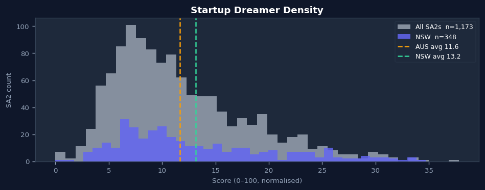

**Top 10 NSW**
| # | SA2 | LGA | Score |
|---|---|---|---|
| 1 | Paddington - Moore Park | Sydney | 34.7 |
| 2 | Double Bay - Darling Point | Woollahra | 33.8 |
| 3 | North Sydney - Lavender Bay | North Sydney | 33.6 |
| 4 | Surry Hills | Sydney | 33.3 |
| 5 | Darlinghurst | Sydney | 32.1 |
| 6 | Potts Point - Woolloomooloo | Sydney | 32.0 |
| 7 | Erskineville - Alexandria | Sydney | 31.3 |
| 8 | Redfern | Sydney | 31.1 |
| 9 | Manly - Fairlight | Northern Beaches | 31.1 |
| 10 | Bondi Beach - North Bondi | Waverley | 30.8 |

**Bottom 10 NSW**
| # | SA2 | LGA | Score |
|---|---|---|---|
| 1 | Barkly | Barkly | 0.0 |
| 2 | Armidale Surrounds - North | Armidale | 0.9 |
| 3 | Junee | Junee | 2.7 |
| 4 | Corowa Surrounds | Federation | 2.9 |
| 5 | Cowra | Cowra | 3.1 |
| 6 | Leeton | Leeton | 3.1 |
| 7 | Muswellbrook | Muswellbrook | 3.3 |
| 8 | Nambucca Heads | Nambucca Valley | 3.3 |
| 9 | Nyngan - Warren | Bogan | 3.4 |
| 10 | Kempsey | Kempsey | 3.6 |

---

### Side Hustle Generation
Part-time workers aged 20–34 as % of all employed 20–34. High = gig economy hub — freelancers, baristas with a podcast, and UX consultants.
> **Calc:** G46A → M+F (`Emp_PartT_20_24` + `Emp_PartT_25_34`) ÷ M+F (`Tot_Emp_20_24` + `Tot_Emp_25_34`)
✅ **High:** Part-time and flexible work is normal for young workers here. Great for studying — plenty of casual jobs and a culture that doesn't judge you for it.
❌ **Low:** Fewer casual options. Full-time or nothing seems to be the expectation — harder to balance around a study schedule.
NSW avg: **30.4** | AUS avg: **31.7** | NSW range: 0.0–52.0
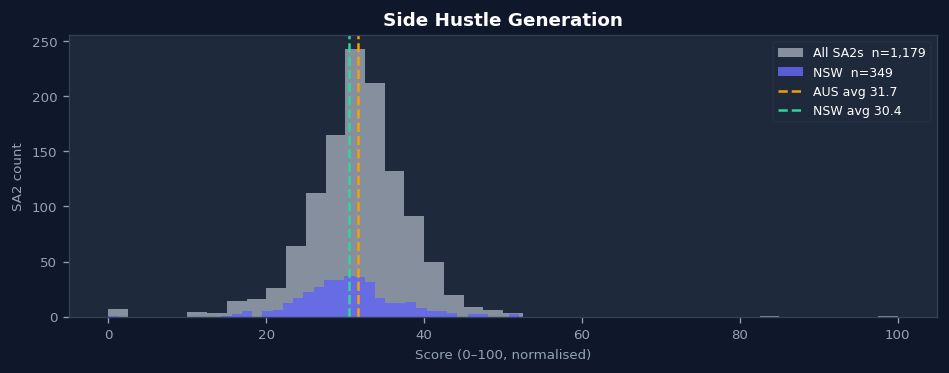

**Top 10 NSW**
| # | SA2 | LGA | Score |
|---|---|---|---|
| 1 | Auburn - North | Cumberland | 52.0 |
| 2 | Mullumbimby | Byron | 51.9 |
| 3 | Shortland - Jesmond | Newcastle | 48.0 |
| 4 | Auburn - Central | Cumberland | 47.1 |
| 5 | Strathfield - East | Burwood | 46.1 |
| 6 | Bangalow | Byron | 45.6 |
| 7 | Lakemba | Canterbury-Bankstown | 43.3 |
| 8 | Hobart | Hobart | 43.3 |
| 9 | Nambucca Heads | Nambucca Valley | 43.2 |
| 10 | Melbourne CBD - West | Melbourne | 42.7 |

**Bottom 10 NSW**
| # | SA2 | LGA | Score |
|---|---|---|---|
| 1 | Wetherill Park Industrial | Fairfield | 0.0 |
| 2 | Double Bay - Darling Point | Woollahra | 15.5 |
| 3 | Banksmeadow | Bayside (NSW) | 15.7 |
| 4 | North Sydney - Lavender Bay | North Sydney | 16.4 |
| 5 | Paddington - Moore Park | Sydney | 17.0 |
| 6 | Crows Nest - Waverton | North Sydney | 17.0 |
| 7 | St Leonards - Naremburn | North Sydney | 17.2 |
| 8 | Erskineville - Alexandria | Sydney | 17.5 |
| 9 | Potts Point - Woolloomooloo | Sydney | 18.1 |
| 10 | Barkly | Barkly | 20.1 |

---

### Bank of Mum & Dad
25–34 year olds with no dependent children as % of 25–34 population. High = still unburdened by school fees — or maybe financially cushioned by parental generosity.
> **Calc:** G27B `P_NDpChl_25_34` ÷ G04A (`Age_yr_25_29_P` + `Age_yr_30_34_P`)
✅ **High:** Lots of 25–34 year olds without dependents — plenty of people in the same life stage, free to socialise without the school-pickup constraint.
❌ **Low:** Most 25–34 year olds here already have children. The area has shifted into family mode — fewer people in your life stage.
NSW avg: **15.4** | AUS avg: **13.1** | NSW range: 0.0–52.0
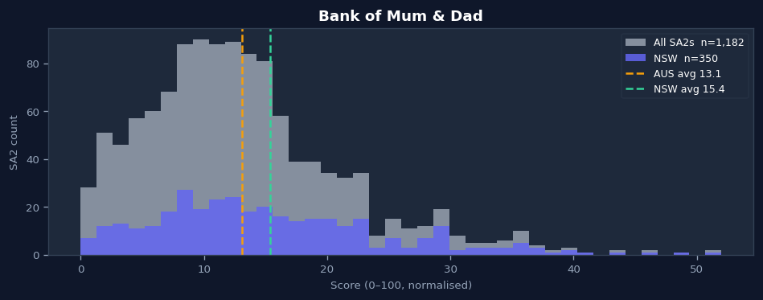

**Top 10 NSW**
| # | SA2 | LGA | Score |
|---|---|---|---|
| 1 | West Pennant Hills | The Hills | 52.0 |
| 2 | Castle Hill - West | The Hills | 49.2 |
| 3 | Lilli Pilli - Port Hacking - Dolans Bay | Sutherland | 46.2 |
| 4 | Horsley Park - Kemps Creek | Fairfield | 43.3 |
| 5 | Hinchinbrook | Liverpool | 40.7 |
| 6 | Castle Hill - North | The Hills | 40.1 |
| 7 | Smithfield - Wetherill Park | Fairfield | 39.5 |
| 8 | Dural - Kenthurst - Wisemans Ferry | The Hills | 38.0 |
| 9 | Prestons | Liverpool | 37.2 |
| 10 | Fairfield | Fairfield | 36.7 |

**Bottom 10 NSW**
| # | SA2 | LGA | Score |
|---|---|---|---|
| 1 | Wetherill Park Industrial | Fairfield | 0.0 |
| 2 | Prospect Reservoir | Blacktown | 0.0 |
| 3 | Banksmeadow | Bayside (NSW) | 0.0 |
| 4 | Melbourne CBD - West | Melbourne | 0.9 |
| 5 | Chippendale | Sydney | 1.0 |
| 6 | Surry Hills | Sydney | 1.2 |
| 7 | Southbank - East | Melbourne | 1.2 |
| 8 | Parramatta - North | Parramatta | 1.3 |
| 9 | Zetland | Sydney | 1.3 |
| 10 | Sydney (South) - Haymarket | Sydney | 1.4 |

---

### Peter Pan Index
Compound: NDpChl rate × 30–34 share of 25–34 cohort. High = lots of 30-somethings who still have no kids. Growing up is optional.
> **Calc:** G27B + G04A → (`P_NDpChl_25_34` ÷ pop_25–34) × (`Age_yr_30_34_P` ÷ pop_25–34) × 100
✅ **High:** People in their 30s here are still kid-free and socially active. The area won't age out from under you as quickly as you'd expect.
❌ **Low:** By 30 here, most people have moved into family mode. The social scene transitions fast — great if you want that, isolating if you don't.
NSW avg: **7.9** | AUS avg: **6.7** | NSW range: 0.0–26.1
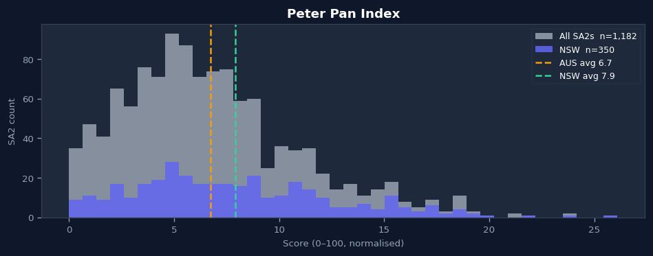

**Top 10 NSW**
| # | SA2 | LGA | Score |
|---|---|---|---|
| 1 | West Pennant Hills | The Hills | 26.1 |
| 2 | Castle Hill - West | The Hills | 23.7 |
| 3 | Lilli Pilli - Port Hacking - Dolans Bay | Sutherland | 21.6 |
| 4 | Castle Hill - North | The Hills | 20.0 |
| 5 | Smithfield - Wetherill Park | Fairfield | 19.4 |
| 6 | Hinchinbrook | Liverpool | 19.1 |
| 7 | Kingsgrove - North | Canterbury-Bankstown | 18.6 |
| 8 | Prestons | Liverpool | 18.5 |
| 9 | Horsley Park - Kemps Creek | Fairfield | 18.3 |
| 10 | Carlingford - East | Parramatta | 18.3 |

**Bottom 10 NSW**
| # | SA2 | LGA | Score |
|---|---|---|---|
| 1 | Wetherill Park Industrial | Fairfield | 0.0 |
| 2 | Prospect Reservoir | Blacktown | 0.0 |
| 3 | Banksmeadow | Bayside (NSW) | 0.0 |
| 4 | Chippendale | Sydney | 0.4 |
| 5 | Melbourne CBD - West | Melbourne | 0.4 |
| 6 | Surry Hills | Sydney | 0.6 |
| 7 | Sydney (South) - Haymarket | Sydney | 0.6 |
| 8 | Southbank - East | Melbourne | 0.6 |
| 9 | Zetland | Sydney | 0.6 |
| 10 | Parramatta - North | Parramatta | 0.7 |

---

### Adulting Score
Lone persons + partnered (no kids) aged 25–34 as % of 25–34 population. High = independent adults making rent, owning plants, and meal-prepping.
> **Calc:** G27B → (`P_LonePsn_25_34` + `P_Ptn_in_RM_25_34` + `P_Ptn_in_DFM_25_34`) ÷ G04A pop_25–34
✅ **High:** Independent living is the norm for 25–34 year olds here — living alone or with a partner, not with parents. You'll fit right in.
❌ **Low:** Many in this age group still live in family households. May reflect high costs forcing people home, or cultural norms around independent living.
NSW avg: **57.7** | AUS avg: **58.0** | NSW range: 0.0–78.8
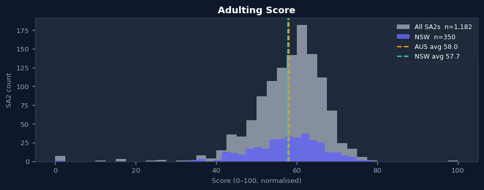

**Top 10 NSW**
| # | SA2 | LGA | Score |
|---|---|---|---|
| 1 | Gledswood Hills - Gregory Hills | Camden | 78.8 |
| 2 | Wentworth Point - Sydney Olympic Park | Parramatta | 77.0 |
| 3 | Jordan Springs - Llandilo | Penrith | 76.8 |
| 4 | Pallara - Willawong | Brisbane | 75.8 |
| 5 | Lane Cove | Lane Cove | 74.6 |
| 6 | Thornton - Millers Forest | Maitland | 74.3 |
| 7 | Schofields - East | Blacktown | 74.2 |
| 8 | St Leonards - Naremburn | North Sydney | 74.2 |
| 9 | Sutherland - Kirrawee | Sutherland | 73.8 |
| 10 | North Kellyville | The Hills | 73.6 |

**Bottom 10 NSW**
| # | SA2 | LGA | Score |
|---|---|---|---|
| 1 | Prospect Reservoir | Blacktown | 0.0 |
| 2 | Yarramundi - Londonderry | Penrith | 34.8 |
| 3 | West Pennant Hills | The Hills | 35.2 |
| 4 | Horsley Park - Kemps Creek | Fairfield | 35.9 |
| 5 | Canley Vale - Canley Heights | Fairfield | 36.3 |
| 6 | Cabramatta - Lansvale | Fairfield | 37.4 |
| 7 | Mullumbimby | Byron | 40.5 |
| 8 | Fairfield | Fairfield | 41.2 |
| 9 | Kempsey | Kempsey | 41.8 |
| 10 | Strathfield - West | Strathfield | 42.0 |

---

### Rent Forever Index
Composite: renters (60%) + student density (40%). High = nobody here is buying — renting is the vibe, the lifestyle, and the 10-year plan.
> **Calc:** Composite → 0.6 × `renter_republic_pct_norm` + 0.4 × `student_bubble_pct_norm`
✅ **High:** Renting is the default lifestyle here — not a temporary phase. Landlords are used to young tenants and the culture supports it.
❌ **Low:** The area assumes you're on a path to ownership. Renters are in the minority and the culture can feel designed for someone else's life stage.
NSW avg: **25.4** | AUS avg: **24.5** | NSW range: 0.0–61.8
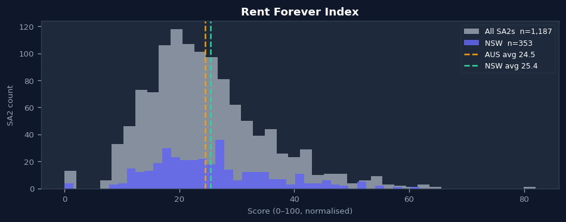

**Top 10 NSW**
| # | SA2 | LGA | Score |
|---|---|---|---|
| 1 | Chippendale | Sydney | 61.8 |
| 2 | Melbourne CBD - West | Melbourne | 58.7 |
| 3 | Zetland | Sydney | 54.9 |
| 4 | Camperdown - Darlington | Sydney | 54.8 |
| 5 | Ultimo | Sydney | 52.5 |
| 6 | Southbank - East | Melbourne | 52.3 |
| 7 | Parramatta - North | Parramatta | 51.5 |
| 8 | Sydney (South) - Haymarket | Sydney | 51.4 |
| 9 | Waterloo | Sydney | 51.3 |
| 10 | Burwood (NSW) | Burwood | 48.5 |

**Bottom 10 NSW**
| # | SA2 | LGA | Score |
|---|---|---|---|
| 1 | Smithfield Industrial | Cumberland | 0.0 |
| 2 | Sydney Airport | Bayside (NSW) | 0.0 |
| 3 | Port Botany Industrial | Randwick | 0.0 |
| 4 | Prospect Reservoir | Blacktown | 0.0 |
| 5 | Bathurst Surrounds | Bathurst | 7.9 |
| 6 | Tomerong - Wandandian - Woollamia | Shoalhaven | 8.6 |
| 7 | Grafton Surrounds | Clarence Valley | 8.8 |
| 8 | Seaham - Woodville | Port Stephens | 9.4 |
| 9 | Queanbeyan Surrounds | Queanbeyan-Palerang | 9.5 |
| 10 | Ulladulla Surrounds | Shoalhaven | 9.5 |

---

### Singles Scene
Never-married 20–34 year olds as % of all 20–34. High = dating-app active zone — lots of first dates and situationships.
> **Calc:** G05 → (`P_20_24_yr_Never_married` + `P_25_34_yr_Never_married`) ÷ (`P_20_24_yr_Tot` + `P_25_34_yr_Tot`)
✅ **High:** Lots of single people in your age group. Active social scene, dating culture is normal, nobody cares that you haven't settled down.
❌ **Low:** Most people your age are already partnered or married. Can feel like a couples suburb — great if you're coupled up, less so if you're not.
NSW avg: **73.0** | AUS avg: **74.3** | NSW range: 48.0–100.0
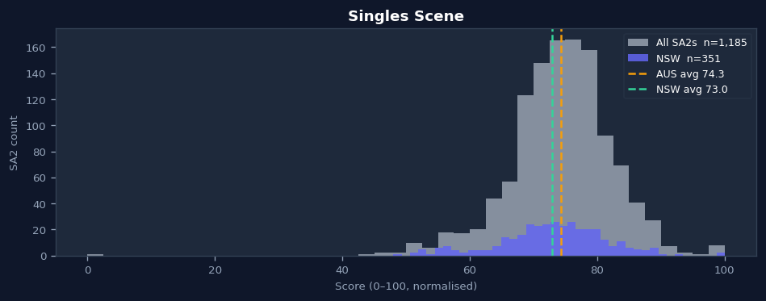

**Top 10 NSW**
| # | SA2 | LGA | Score |
|---|---|---|---|
| 1 | Wetherill Park Industrial | Fairfield | 100.0 |
| 2 | Sydney Airport | Bayside (NSW) | 100.0 |
| 3 | Camperdown - Darlington | Sydney | 93.4 |
| 4 | Newtown (NSW) | Sydney | 90.1 |
| 5 | Surry Hills | Sydney | 89.4 |
| 6 | Redfern | Sydney | 89.3 |
| 7 | Bondi Beach - North Bondi | Waverley | 89.2 |
| 8 | Darlinghurst | Sydney | 89.2 |
| 9 | Potts Point - Woolloomooloo | Sydney | 89.1 |
| 10 | Chippendale | Sydney | 88.7 |

**Bottom 10 NSW**
| # | SA2 | LGA | Score |
|---|---|---|---|
| 1 | Gledswood Hills - Gregory Hills | Camden | 48.0 |
| 2 | Rosehill - Harris Park | Parramatta | 50.7 |
| 3 | Pallara - Willawong | Brisbane | 51.4 |
| 4 | Schofields - East | Blacktown | 52.0 |
| 5 | Parramatta - North | Parramatta | 52.2 |
| 6 | Lakemba | Canterbury-Bankstown | 52.2 |
| 7 | Auburn - North | Cumberland | 52.6 |
| 8 | Bankstown - North | Canterbury-Bankstown | 53.1 |
| 9 | Blacktown (East) - Kings Park | Blacktown | 53.7 |
| 10 | Jordan Springs - Llandilo | Penrith | 54.9 |

---

### DINK Potential
Partnered (no kids) 25–34 as % of 25–34 population. High = dual income, no kids energy — brunch every weekend, two car payments.
> **Calc:** G27B → (`P_Ptn_in_RM_25_34` + `P_Ptn_in_DFM_25_34`) ÷ G04A pop_25–34
✅ **High:** Lots of dual-income couples without kids — that spending power flows into local venues, food, and experiences. Great local economy.
❌ **Low:** Either very singles-dominated or already into kids territory. Fewer couples without dependents means less of that middle-income discretionary spending locally.
NSW avg: **50.6** | AUS avg: **50.1** | NSW range: 0.0–75.0
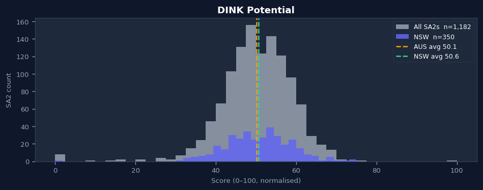

**Top 10 NSW**
| # | SA2 | LGA | Score |
|---|---|---|---|
| 1 | Gledswood Hills - Gregory Hills | Camden | 75.0 |
| 2 | Jordan Springs - Llandilo | Penrith | 73.4 |
| 3 | Pallara - Willawong | Brisbane | 72.1 |
| 4 | Thornton - Millers Forest | Maitland | 69.9 |
| 5 | Douglas Park - Appin | Wollondilly | 69.0 |
| 6 | Riverstone | Blacktown | 69.0 |
| 7 | Currans Hill | Camden | 68.2 |
| 8 | North Kellyville | The Hills | 67.9 |
| 9 | Schofields - East | Blacktown | 67.7 |
| 10 | Maitland | Maitland | 65.9 |

**Bottom 10 NSW**
| # | SA2 | LGA | Score |
|---|---|---|---|
| 1 | Prospect Reservoir | Blacktown | 0.0 |
| 2 | Yarramundi - Londonderry | Penrith | 31.7 |
| 3 | Ultimo | Sydney | 32.1 |
| 4 | Canley Vale - Canley Heights | Fairfield | 33.0 |
| 5 | West Pennant Hills | The Hills | 33.6 |
| 6 | Hobart | Hobart | 33.7 |
| 7 | Cabramatta - Lansvale | Fairfield | 34.3 |
| 8 | Sydney (South) - Haymarket | Sydney | 34.6 |
| 9 | Horsley Park - Kemps Creek | Fairfield | 35.0 |
| 10 | Mullumbimby | Byron | 35.3 |

---

### Delayed Adulting Score
Composite: singles + sharehouse residents + renters. High = classic quarter-life zone — independent but not quite settled.
> **Calc:** Composite → mean(`singles_scene_norm`, `sharehouse_capital_norm`, `renter_republic_pct_norm`)
✅ **High:** Classic quarter-life territory — everyone is roughly in the same boat. Single-ish, renting, figuring it out. You won't be the only one.
❌ **Low:** The area has moved on. People are settled, owned, and partnered. You might feel like you arrived at a party that ended five years ago.
NSW avg: **38.0** | AUS avg: **38.3** | NSW range: 0.0–63.2
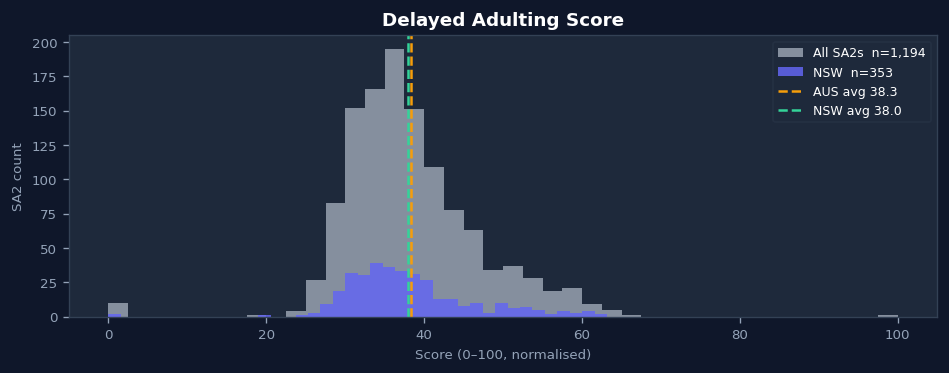

**Top 10 NSW**
| # | SA2 | LGA | Score |
|---|---|---|---|
| 1 | Chippendale | Sydney | 63.2 |
| 2 | Melbourne CBD - West | Melbourne | 62.1 |
| 3 | Ultimo | Sydney | 60.8 |
| 4 | Surry Hills | Sydney | 60.6 |
| 5 | Redfern | Sydney | 60.6 |
| 6 | Waterloo | Sydney | 60.1 |
| 7 | Sydney (South) - Haymarket | Sydney | 60.0 |
| 8 | Newtown (NSW) | Sydney | 59.5 |
| 9 | Zetland | Sydney | 58.8 |
| 10 | Southbank - East | Melbourne | 58.1 |

**Bottom 10 NSW**
| # | SA2 | LGA | Score |
|---|---|---|---|
| 1 | Smithfield Industrial | Cumberland | 0.0 |
| 2 | Port Botany Industrial | Randwick | 0.0 |
| 3 | Prospect Reservoir | Blacktown | 19.0 |
| 4 | Douglas Park - Appin | Wollondilly | 24.9 |
| 5 | Gledswood Hills - Gregory Hills | Camden | 25.6 |
| 6 | The Oaks - Oakdale | Wollondilly | 26.2 |
| 7 | Pallara - Willawong | Brisbane | 26.6 |
| 8 | Queanbeyan Surrounds | Queanbeyan-Palerang | 27.3 |
| 9 | Kurrajong Heights - Ebenezer | Hawkesbury | 27.4 |
| 10 | Seaham - Woodville | Port Stephens | 27.4 |

---

### Global Youth Hub
Overseas-born × youth density compound score. High = young, international, multilingual — think food halls and group chats in four languages.
> **Calc:** G02 `overseas_born_pct` × G04A `youth_pct` ÷ 100 → clipped at 99th percentile, scaled 0–100
✅ **High:** Young, international, multicultural community. Easy to meet people from everywhere. International students will feel at home immediately.
❌ **Low:** Older or more locally-born population. Less international energy — may feel homogeneous if you've come from somewhere else.
NSW avg: **11.4** | AUS avg: **10.0** | NSW range: 0.0–100.0
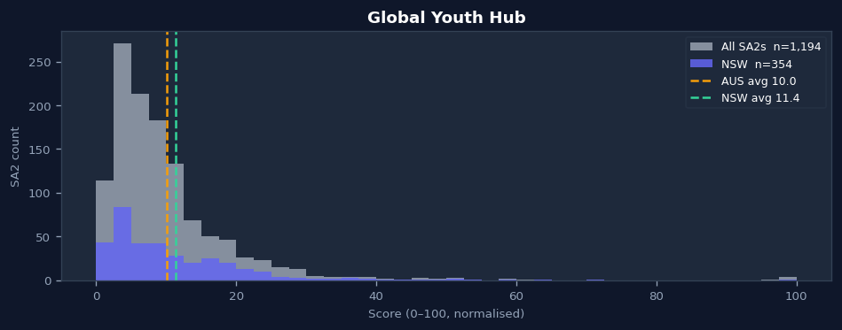

**Top 10 NSW**
| # | SA2 | LGA | Score |
|---|---|---|---|
| 1 | Sydney Airport | Bayside (NSW) | 100.0 |
| 2 | Chippendale | Sydney | 70.0 |
| 3 | Melbourne CBD - West | Melbourne | 64.6 |
| 4 | Auburn - North | Cumberland | 58.0 |
| 5 | Burwood (NSW) | Burwood | 54.9 |
| 6 | Ultimo | Sydney | 51.3 |
| 7 | Sydney (South) - Haymarket | Sydney | 51.2 |
| 8 | Strathfield - East | Burwood | 49.8 |
| 9 | Hurstville - Central | Georges River | 46.5 |
| 10 | Auburn - Central | Cumberland | 43.1 |

**Bottom 10 NSW**
| # | SA2 | LGA | Score |
|---|---|---|---|
| 1 | Port Kembla Industrial | Wollongong | 0.0 |
| 2 | Smithfield Industrial | Cumberland | 0.0 |
| 3 | Wetherill Park Industrial | Fairfield | 0.0 |
| 4 | Port Botany Industrial | Randwick | 0.0 |
| 5 | Prospect Reservoir | Blacktown | 0.0 |
| 6 | Inverell Surrounds - West | Gwydir | 0.7 |
| 7 | Barkly | Barkly | 0.9 |
| 8 | Nyngan - Warren | Bogan | 1.0 |
| 9 | Forbes | Forbes | 1.0 |
| 10 | Armidale Surrounds - North | Armidale | 1.1 |

---

### Nightlife Index
Composite: night economy + entertainment + food scene. High = alive after 9pm — real venues, real bars, real reason to stay out.
> **Calc:** Composite → mean(`night_economy_pct_norm`, `entertainment_pct_norm`, `food_scene_pct_norm`)
✅ **High:** Actual nightlife exists here — real venues, real bars, real reason to leave the house after 8pm that isn't a petrol station.
❌ **Low:** Roll up the footpath after dinner. Any night out requires Ubering somewhere else and negotiating who's paying.
NSW avg: **5.6** | AUS avg: **6.1** | NSW range: 0.2–14.6
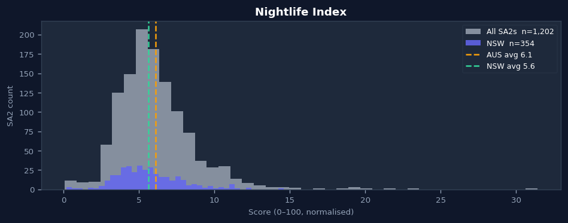

**Top 10 NSW**
| # | SA2 | LGA | Score |
|---|---|---|---|
| 1 | Moama | Murray River | 14.6 |
| 2 | Nelson Bay Peninsula | Port Stephens | 12.3 |
| 3 | Sydney (South) - Haymarket | Sydney | 12.1 |
| 4 | Pyrmont | Sydney | 11.6 |
| 5 | Terrigal - North Avoca | Central Coast (NSW) | 11.3 |
| 6 | The Entrance | Central Coast (NSW) | 11.1 |
| 7 | Newtown (NSW) | Sydney | 11.1 |
| 8 | Bondi Beach - North Bondi | Waverley | 11.0 |
| 9 | Katoomba - Leura | Blue Mountains | 11.0 |
| 10 | Ulladulla Surrounds | Shoalhaven | 11.0 |

**Bottom 10 NSW**
| # | SA2 | LGA | Score |
|---|---|---|---|
| 1 | Port Botany Industrial | Randwick | 0.2 |
| 2 | Smithfield Industrial | Cumberland | 0.3 |
| 3 | Port Kembla Industrial | Wollongong | 0.4 |
| 4 | Wetherill Park Industrial | Fairfield | 0.9 |
| 5 | Prospect Reservoir | Blacktown | 1.0 |
| 6 | Horsley Park - Kemps Creek | Fairfield | 1.9 |
| 7 | Chullora | Canterbury-Bankstown | 1.9 |
| 8 | Armidale Surrounds - North | Armidale | 2.3 |
| 9 | Banksmeadow | Bayside (NSW) | 2.4 |
| 10 | Strathfield - West | Strathfield | 2.5 |

---

### Digital Nomad Potential
Composite: WFH culture + knowledge hub + knowledge workers. High = laptop-and-latte territory — Slack at 11am, gym at 2pm.
> **Calc:** Composite → mean(`wfh_pct_norm`, `knowledge_hub_pct_norm`, `knowledge_worker_pct_norm`)
✅ **High:** Working from a café until 3pm is completely normal here. Co-working culture is embedded and nobody stares at your laptop.
❌ **Low:** Very 9-to-5 energy. Everyone commutes to an office. The concept of 'laptop-friendly café' is theoretical.
NSW avg: **24.4** | AUS avg: **20.4** | NSW range: 0.8–51.0
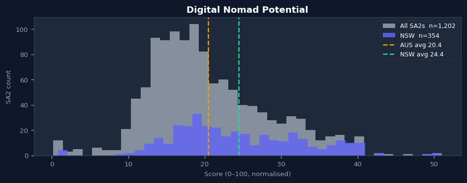

**Top 10 NSW**
| # | SA2 | LGA | Score |
|---|---|---|---|
| 1 | Redfern | Sydney | 51.0 |
| 2 | Sydney (North) - Millers Point | Sydney | 50.8 |
| 3 | North Sydney - Lavender Bay | North Sydney | 49.6 |
| 4 | Surry Hills | Sydney | 43.3 |
| 5 | Crows Nest - Waverton | North Sydney | 43.0 |
| 6 | Pyrmont | Sydney | 40.8 |
| 7 | St Leonards - Naremburn | North Sydney | 40.6 |
| 8 | Manly - Fairlight | Northern Beaches | 40.6 |
| 9 | Chatswood (West) - Lane Cove North | Willoughby | 40.6 |
| 10 | Melbourne CBD - West | Melbourne | 40.5 |

**Bottom 10 NSW**
| # | SA2 | LGA | Score |
|---|---|---|---|
| 1 | Port Kembla Industrial | Wollongong | 0.8 |
| 2 | Port Botany Industrial | Randwick | 0.8 |
| 3 | Prospect Reservoir | Blacktown | 1.1 |
| 4 | Smithfield Industrial | Cumberland | 1.2 |
| 5 | Barkly | Barkly | 9.1 |
| 6 | Tamworth - West | Tamworth | 9.9 |
| 7 | Muswellbrook | Muswellbrook | 10.0 |
| 8 | Singleton | Singleton | 11.1 |
| 9 | Griffith (NSW) | Griffith | 11.2 |
| 10 | Corowa Surrounds | Federation | 11.4 |

---

### Just One More Degree
Tertiary students aged 25+ (FT or PT) as % of all enrolled. High = serial degree collectors — the PhD is just in case.
> **Calc:** G15 → (`Tert_Uni_oth_h_edu_Ft_25_ov_P` + `Tert_Uni_oth_h_edu_Pt_25_ov_P` + `Tert_Voc_edu_Ft_25_ov_P` + `Tert_Voc_edu_Pt_25_ov_P`) ÷ `Tot_P`
✅ **High:** Postgrad and adult-learner culture is strong. You won't be the oldest person in the tutorial, and nobody finds a second degree unusual.
❌ **Low:** Studying is firmly for the under-25s here. Postgrad culture is thin — you may feel like an outlier continuing your education later.
NSW avg: **12.9** | AUS avg: **12.8** | NSW range: 0.0–100.0
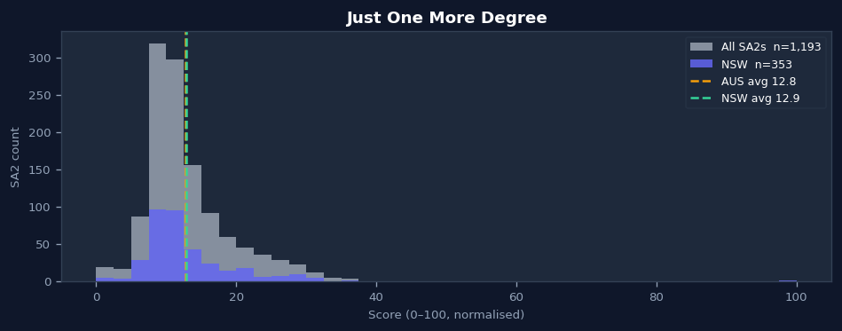

**Top 10 NSW**
| # | SA2 | LGA | Score |
|---|---|---|---|
| 1 | Prospect Reservoir | Blacktown | 100.0 |
| 2 | Southbank - East | Melbourne | 36.1 |
| 3 | Ultimo | Sydney | 32.1 |
| 4 | Melbourne CBD - West | Melbourne | 31.5 |
| 5 | Hobart | Hobart | 30.7 |
| 6 | Wentworth Point - Sydney Olympic Park | Parramatta | 30.5 |
| 7 | Rhodes | Canada Bay | 29.9 |
| 8 | Darlinghurst | Sydney | 29.9 |
| 9 | Potts Point - Woolloomooloo | Sydney | 29.5 |
| 10 | Surry Hills | Sydney | 29.4 |

**Bottom 10 NSW**
| # | SA2 | LGA | Score |
|---|---|---|---|
| 1 | Smithfield Industrial | Cumberland | 0.0 |
| 2 | Wetherill Park Industrial | Fairfield | 0.0 |
| 3 | Sydney Airport | Bayside (NSW) | 0.0 |
| 4 | Port Botany Industrial | Randwick | 0.0 |
| 5 | Barkly | Barkly | 3.0 |
| 6 | Yarramundi - Londonderry | Penrith | 3.2 |
| 7 | Horsley Park - Kemps Creek | Fairfield | 4.0 |
| 8 | Junee | Junee | 5.6 |
| 9 | Moama | Murray River | 5.9 |
| 10 | Pitt Town - McGraths Hill | Hawkesbury | 6.0 |

---

### Flat White Density
Composite: food scene + knowledge hub + startup dreamers. High = every third person is ordering a cortado and pitching a SaaS idea.
> **Calc:** Composite → mean(`food_scene_pct_norm`, `knowledge_hub_pct_norm`, `startup_dreamer_density_norm`)
✅ **High:** The trifecta — good coffee, smart people, and startup energy. Productivity and casual networking happen in the same room at the same time.
❌ **Low:** Not that kind of suburb. No one is pitching a SaaS idea over a pour-over. Which, honestly, might be a relief.
NSW avg: **10.0** | AUS avg: **9.3** | NSW range: 0.9–31.4
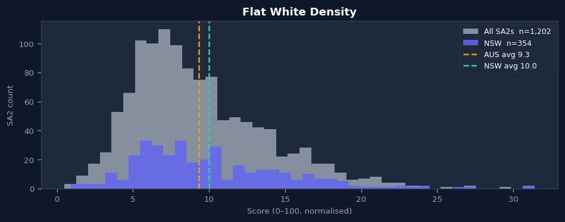

**Top 10 NSW**
| # | SA2 | LGA | Score |
|---|---|---|---|
| 1 | Sydney (North) - Millers Point | Sydney | 31.4 |
| 2 | Redfern | Sydney | 30.7 |
| 3 | North Sydney - Lavender Bay | North Sydney | 27.0 |
| 4 | Melbourne CBD - West | Melbourne | 26.8 |
| 5 | Surry Hills | Sydney | 24.4 |
| 6 | Manly - Fairlight | Northern Beaches | 24.1 |
| 7 | Pyrmont | Sydney | 23.4 |
| 8 | Chippendale | Sydney | 22.7 |
| 9 | Bondi Beach - North Bondi | Waverley | 22.6 |
| 10 | Newtown (NSW) | Sydney | 22.0 |

**Bottom 10 NSW**
| # | SA2 | LGA | Score |
|---|---|---|---|
| 1 | Port Kembla Industrial | Wollongong | 0.9 |
| 2 | Port Botany Industrial | Randwick | 1.0 |
| 3 | Barkly | Barkly | 1.5 |
| 4 | Prospect Reservoir | Blacktown | 1.9 |
| 5 | Armidale Surrounds - North | Armidale | 2.2 |
| 6 | Smithfield Industrial | Cumberland | 2.3 |
| 7 | Tamworth - West | Tamworth | 2.6 |
| 8 | Junee | Junee | 2.9 |
| 9 | Sydney Airport | Bayside (NSW) | 3.1 |
| 10 | Wetherill Park Industrial | Fairfield | 3.2 |

---
